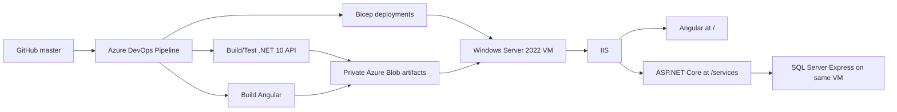

# Production Azure DevOps deployment

This folder contains the production Azure DevOps CI/CD and Infrastructure-as-Code for Smart Task Management System. It is intentionally separate from the repository's **development-only GitHub Actions deployment**.

The production design uses a **Windows Server 2022 Azure VM** in **Southeast Asia**, **IIS** for both the Angular frontend and ASP.NET Core API, and **SQL Server 2022 Express** on the same VM. Azure DevOps builds the backend and frontend, provisions/reconciles Azure infrastructure with Bicep, applies EF Core migrations, deploys the application, configures IIS/HTTPS, and performs a public smoke test.

## Development vs. production CI/CD

There are two intentionally separate Azure deployment systems in this repository. New contributors should not treat the GitHub Actions workflow and the Azure DevOps pipeline as interchangeable.

| System | Environment | Primary branch/triggers | Hosting design |
| --- | --- | --- | --- |
| **GitHub Actions** (`.github/workflows/dev-cicd.yml`) | **Development only** | Automatic on pushes to `dev` and `feature/dev/**`; PRs targeting `dev` run validation without deployment; `workflow_dispatch` is also available. It does **not** automatically run for `master`. | Ubuntu VM + Nginx + Azure SQL and development Azure resources (`stms-dev-*`). |
| **Azure DevOps** (`Azure/infra/prod/azure-pipelines-prod.yml`) | **Production only** | Pushes to `master` build/test/deploy; PRs targeting `master` build/test but do not deploy; manual runs are supported. | Windows Server 2022 + IIS + local SQL Server Express and production Azure resources (`stms-prod-*`). |

In short:

```text
dev / feature/dev/**  -> GitHub Actions -> DEVELOPMENT
master                 -> Azure DevOps   -> PRODUCTION
```

The GitHub Actions workflow must not be used as the production deployment path. Likewise, the production Azure DevOps pipeline must not be treated as the development pipeline. The development cleanup workflow and the production cleanup pipeline are also separate and target different resource groups.

## Files

| File | Purpose |
| --- | --- |
| [`azure-pipelines-prod.yml`](azure-pipelines-prod.yml) | Main production CI/CD pipeline. Builds, tests, packages, provisions, deploys, migrates, configures IIS, and verifies production. |
| [`azure-pipelines-prod-cleanup.yml`](azure-pipelines-prod-cleanup.yml) | Manual destructive pipeline that deletes `stms-prod-rg` and everything inside it. |
| [`rg.bicep`](rg.bicep) | Subscription-scope creation of the production resource group. |
| [`storage.bicep`](storage.bicep) | Private deployment artifact storage account/container. |
| [`vm-windows.bicep`](vm-windows.bicep) | Windows Server VM, VNet, subnet, NSG, NIC, public IP, and managed OS disk. |
| [`parameters/vm-windows-prod.json`](parameters/vm-windows-prod.json) | Production VM/network names and the default VM size. |

## Production architecture



Current production defaults:

| Setting | Value |
| --- | --- |
| Azure region | `southeastasia` |
| Resource group | `stms-prod-rg` |
| VM | `stms-prod-vm` |
| VM size | `Standard_D2_v3` |
| VM administrator | `stmsadmin` |
| OS | Windows Server 2022 Datacenter |
| Web server | IIS |
| Frontend path | `C:\inetpub\stms-prod-web` |
| API path | `C:\inetpub\stms-prod-api` |
| IIS site | `STMS-PROD` |
| API IIS application | `/services` |
| SQL instance | `.\SQLEXPRESS` |
| Database | `stms-prod-db` |
| Deployment storage | `stmsprodartifacts` / `deployments` |
| Frontend API base | `/services/api` |
| Health endpoint | `/services/health` externally |

The Bicep NSG opens TCP **80** and **443**. RDP is not opened by the committed production Bicep; any temporary RDP access enabled manually should be treated as an operational exception and removed/restricted when no longer needed.

## Pipeline behavior

The main pipeline is [`azure-pipelines-prod.yml`](azure-pipelines-prod.yml).

### Triggers

- **Push to `master`:** build/test and deploy production.
- **Pull request targeting `master`:** build/test only; production deployment is skipped.
- **Manual run:** build/test and deploy the selected `master` revision.

### Stages

1. **Preflight**
   - Checks Azure regional and VM-family vCPU quota for `Standard_D2_v3` / `standardDv3Family`.
   - The Azure quota task is skipped for pull-request validation.

2. **Build and Test**
   - Backend uses .NET 10 on a Windows hosted agent.
   - Runs `dotnet restore`, Release build, and `Infrastructure.Tests`.
   - Publishes the API self-contained for `win-x64`.
   - Creates a self-contained EF Core migration bundle using `dotnet-ef` `10.0.9`.
   - Frontend uses Node.js 22, `npm ci`, and the production Angular build.
   - Validates that `environment.prod.ts` uses `apiBaseUrl: '/services/api'`.
   - Generates the IIS Angular `web.config` for SPA fallback while excluding `/services`.
   - Publishes backend and frontend ZIP artifacts.

3. **Deploy Production**
   - Does not run for pull requests.
   - Uses the Azure DevOps environment **`Production`**.
   - Deploys/reconciles the resource group, storage, network, public IP, and Windows VM with Bicep.
   - Uploads deployment packages to the private blob container.
   - Generates short-lived read-only SAS URIs for the exact backend/frontend blobs.
   - Uses Azure VM Run Command to configure the VM in independent phases.

### VM configuration phases

The deployment deliberately splits Windows configuration into phases so a failure identifies the failing layer rather than leaving one long opaque Run Command.

#### 01 - Prerequisites

Installs or verifies:

- IIS and required Windows web features.
- IIS URL Rewrite.
- ASP.NET Core/.NET 10 Hosting Bundle / ASP.NET Core Module.

The phase is designed to be idempotent: already-installed components are detected and skipped where possible.

#### 02 - SQL Express

- Detects the `MSSQL$SQLEXPRESS` Windows service.
- Installs SQL Server 2022 Express only when the instance does not already exist.
- Uses SQL authentication for the application.
- Keeps the SQL service configured for automatic startup.

Ordinary application deployments to the same VM do **not** reinstall SQL Express. Recreating the VM means SQL Express must be installed again because it is a new machine.

#### 03 - Application

- Downloads the backend/frontend packages through freshly generated SAS URIs.
- Expands packages to staging directories.
- Builds the SQL connection string for `.\SQLEXPRESS` / `stms-prod-db`.
- Sets machine-level production configuration, including connection string, CORS, JWT, and Groq settings.
- Executes the EF Core migration bundle before switching deployed application files.
- Copies the API to `C:\inetpub\stms-prod-api` and Angular to `C:\inetpub\stms-prod-web`.
- Applies IIS read permissions.

#### 04 - IIS and HTTPS

- Creates/reconciles the `STMS-PROD-Web-Pool` and `STMS-PROD-Api-Pool` application pools.
- Creates/reconciles the `STMS-PROD` IIS site.
- Mounts the API as the IIS application `/services`.
- Creates or reuses the production self-signed certificate for the VM public IP.
- Binds HTTPS on port 443.
- Restarts IIS and completes the VM configuration phase.

The VM phase does not perform the old `http://localhost/services/health` check because ASP.NET Core HTTPS redirection can make that localhost HTTP probe fail even when production is working.

### Final production smoke test

After VM configuration, a separate Azure DevOps task tests the actual public endpoints:

```text
https://<VM_PUBLIC_IP>/
https://<VM_PUBLIC_IP>/services/health
```

The current production certificate is self-signed, so the pipeline smoke test uses `-SkipCertificateCheck`. Browser clients must explicitly trust the exported certificate or the deployment must later be changed to use a publicly trusted IP certificate.

## One-time Azure DevOps setup

### 1. Connect GitHub to Azure DevOps

The repository remains hosted on GitHub while Azure DevOps executes the production pipeline. This GitHub connection is for the **production Azure DevOps pipeline**; it is separate from GitHub Actions, which continues to handle development CI/CD from the repository itself.

In Azure DevOps:

1. Open the Azure DevOps project.
2. Go to **Project settings -> Service connections**.
3. Select **New service connection**.
4. Select **GitHub** and authorize Azure Pipelines with the GitHub account that has access to this repository.
5. Grant Azure Pipelines access to `tanvir14012/DatavancedBD.AspNetCore.SmartTaskManagementSystem` when GitHub asks which repositories the connection may access.

You can also let **Pipelines -> New pipeline -> GitHub** create/authorize the GitHub connection during pipeline creation.

Microsoft documentation: <https://learn.microsoft.com/azure/devops/pipelines/repos/github>

### 2. Create the production Azure DevOps pipeline

1. Go to **Pipelines -> New pipeline**.
2. Select **GitHub**.
3. Select `tanvir14012/DatavancedBD.AspNetCore.SmartTaskManagementSystem`.
4. Choose **Existing Azure Pipelines YAML file**.
5. Select branch **`master`**.
6. Select:

   ```text
   Azure/infra/prod/azure-pipelines-prod.yml
   ```

7. Save the pipeline. Give it a clear name such as `STMS-Production`.

### 3. Create the cleanup Azure DevOps pipeline

Create a second pipeline from the same GitHub repository, but point it to:

```text
Azure/infra/prod/azure-pipelines-prod-cleanup.yml
```

A clear name is `STMS-Production-Cleanup`.

The cleanup YAML has `trigger: none` and `pr: none`, so it is manual-only.

### 4. Create the Azure DevOps `Production` environment

The production deployment job references:

```yaml
environment: Production
```

Create it before the first production deployment:

1. Go to **Pipelines -> Environments**.
2. Select **New environment**.
3. Name it exactly **`Production`**.
4. Choose **None** for the resource type unless you intentionally want to register a VM resource.
5. Optionally configure **Approvals and checks** if production should require manual approval.

## Azure Resource Manager service connection

Both production pipelines expect the exact service connection name:

```text
STMS-Azure-Service-Connection
```

### Recommended configuration

Use Microsoft Entra **Workload Identity Federation** rather than a client secret.

1. In Azure DevOps go to **Project settings -> Service connections**.
2. Select **New service connection**.
3. Select **Azure Resource Manager**.
4. For identity, select **App registration (automatic)**.
5. For credential, select **Workload identity federation**.
6. Set **Scope level** to **Subscription**.
7. Select the Azure subscription that will host production.
8. Leave **Resource group** empty. The pipeline itself creates `stms-prod-rg`, so a service connection scoped to a resource group that does not yet exist is not appropriate.
9. Set the service connection name exactly to:

   ```text
   STMS-Azure-Service-Connection
   ```

10. Save/verify the service connection.

The service principal behind this connection needs enough subscription-level rights to create/delete the resource group and manage the resources used by the pipeline. **Contributor** at the target subscription is the normal minimum for the current production templates/actions. The user creating the automatic service connection also needs sufficient Microsoft Entra/Azure rights to create the app registration and establish the Azure role assignment.

Microsoft documentation recommends workload identity federation and documents Azure Resource Manager service connections here: <https://learn.microsoft.com/azure/devops/pipelines/library/connect-to-azure>

### Pipeline authorization

Do not grant the service connection to every pipeline unless that is an intentional project-wide policy.

Prefer authorizing only:

- `STMS-Production`
- `STMS-Production-Cleanup`

If the first run reports that `STMS-Azure-Service-Connection` is not authorized, open the service connection's **Pipeline permissions/Security** settings and explicitly permit those pipelines, or use the Azure DevOps **Authorize resources** prompt on the failed run.

### Manual workload-identity fallback

If **App registration (automatic)** is blocked by tenant policy, use the manual workload-identity flow instead:

1. Create an app registration in Microsoft Entra ID.
2. In Azure DevOps create an Azure Resource Manager service connection using **App registration or managed identity (manual)** + **Workload identity federation credential**.
3. Copy the **Issuer** and **Subject identifier** generated by Azure DevOps.
4. In the app registration, open **Certificates & secrets -> Federated credentials** and add an **Other issuer** credential using those exact values.
5. Grant the app registration the required Azure subscription role (normally Contributor for this pipeline).
6. Return to Azure DevOps and **Verify and save** the service connection.

Microsoft manual WIF guide: <https://learn.microsoft.com/azure/devops/pipelines/release/configure-workload-identity>

## Production pipeline secrets

Configure these as **secret Azure DevOps pipeline variables** on the production pipeline. Do not commit them to YAML or JSON.

| Variable | Purpose |
| --- | --- |
| `VM_ADMIN_PASSWORD` | Password for the Windows VM administrator `stmsadmin`. |
| `SQL_SA_PASSWORD` | SQL Server Express `sa` password and application database connection. |
| `JWT_KEY` | Production JWT HMAC signing key. Use at least 32 bytes of strong random material. |
| `GROQ_API_KEY` | Groq API authentication for AI features. |

Typical UI path:

1. Open `STMS-Production`.
2. Select **Edit**.
3. Open **Variables**.
4. Add each variable above.
5. Mark each one **Keep this value secret**.
6. Save.

The VM and SQL passwords must satisfy the respective Windows/SQL password complexity requirements.

The cleanup pipeline does not require these four application secrets; it only needs access to `STMS-Azure-Service-Connection`.

## Resource provisioning

The production pipeline deploys these resources into `stms-prod-rg`:

- Windows Server VM `stms-prod-vm`.
- Standard static public IP `stms-prod-pip`.
- NIC `stms-prod-nic`.
- VNet `stms-prod-vnet` (`10.10.0.0/16`).
- Subnet `stms-prod-subnet` (`10.10.1.0/24`).
- NSG `stms-prod-nsg`.
- Managed VM OS disk.
- Storage account `stmsprodartifacts` with private `deployments` container.

The storage-account name is globally scoped by Azure. If `stmsprodartifacts` is unavailable in a different subscription/tenant, change the pipeline/template value to another globally unique storage account name.

### VM quota

The current subscription/region configuration uses:

```text
Standard_D2_v3
standardDv3Family
2 vCPUs
```

The pipeline fails early when that family or regional vCPU quota cannot satisfy the VM. If moving subscriptions or regions, check Azure quota before changing the YAML/parameter file.

## Runtime configuration

Phase 03 sets these production configuration values on the VM:

- `ASPNETCORE_ENVIRONMENT=Production`
- `DOTNET_ENVIRONMENT=Production`
- `ConnectionStrings__DefaultConnection`
- `Cors__AllowedOrigins__0=https://<VM_PUBLIC_IP>`
- `Cors__AllowedOrigins__1=http://<VM_PUBLIC_IP>`
- `Jwt__Issuer=https://<VM_PUBLIC_IP>`
- `Jwt__Audience=https://<VM_PUBLIC_IP>`
- `Jwt__Key`
- `Ai__GroqApiKey`

The Angular production application must use the relative API base:

```ts
apiBaseUrl: '/services/api'
```

This keeps browser requests on the same origin as the frontend when it is served by IIS.

## HTTPS certificate

The pipeline currently creates/reuses a self-signed certificate with the VM public IP in the certificate SAN and binds it to IIS port 443.

This protects traffic cryptographically but is not automatically trusted by public browsers. For a workstation used to test this deployment, export only the public certificate (for example Base-64 X.509 `.cer`) and import it into the workstation's **Trusted Root Certification Authorities** store. Do not export/distribute the VM certificate's private key merely to make a browser trust the site.

If TLS is later moved to a publicly trusted IP certificate, certificate renewal should be handled independently from normal application deployments.

## Cleanup pipeline

[`azure-pipelines-prod-cleanup.yml`](azure-pipelines-prod-cleanup.yml) is destructive and manual-only.

It targets only:

```text
stms-prod-rg
```

When that resource group is deleted, all resources inside it are deleted with it, including the VM, managed disk, public IP, NIC, VNet, NSG, deployment storage account, blob artifacts, SQL Express installation/data on the VM disk, IIS files, and certificate stored on that VM.

### Run cleanup

1. Open the `STMS-Production-Cleanup` pipeline in Azure DevOps.
2. Select **Run pipeline**.
3. Set:

   ```text
   confirmDestroy = true
   ```

4. Run the pipeline.
5. The pipeline checks whether `stms-prod-rg` exists, deletes it, waits for the Azure CLI deletion command to complete, and verifies the group no longer exists.

If `confirmDestroy` remains `false`, the pipeline deliberately fails with a message explaining that cleanup was not executed.

The cleanup pipeline does **not** target development resource groups or unrelated subscription resources.

## Recreate production after cleanup

After cleanup, simply run the normal production pipeline again. It recreates the resource group and infrastructure, provisions a new VM, installs IIS/.NET/SQL Express, applies migrations to the new local SQL instance, deploys the application, and creates a new public IP/certificate as required.

Because SQL Express is stored on the production VM, deleting the resource group deletes the production database. The cleanup pipeline is therefore a full environment teardown, not an application rollback.

## Operational checks

On the VM, useful PowerShell checks include:

```powershell
Import-Module WebAdministration
Get-Website -Name 'STMS-PROD'
Get-WebApplication -Site 'STMS-PROD'
Get-WebAppPoolState -Name 'STMS-PROD-Api-Pool'
Get-Service 'MSSQL$SQLEXPRESS'
```

Public smoke tests:

```text
https://<VM_PUBLIC_IP>/
https://<VM_PUBLIC_IP>/services/health
```

When using the current self-signed certificate from an untrusted machine, a browser will report a certificate-authority warning until the certificate is trusted locally.

## Common first-run failures

| Symptom | Meaning / action |
| --- | --- |
| Service connection not found/not authorized | Create `STMS-Azure-Service-Connection` and authorize the two production pipelines. |
| VM family quota is `0` | Request quota or choose a VM family that already has subscription quota in `southeastasia`. |
| `SkuNotAvailable` | The chosen SKU has regional/capacity restrictions; verify with `az vm list-skus`. |
| OS disk smaller than image | Do not force the Windows image OS disk below its native size; the current Bicep lets Azure choose the required image size. |
| IIS URL Rewrite download/install failure | Check the prerequisite phase and `C:\stms-prod-install\rewrite-install.log`. |
| SQL phase is slow | First installation is the expensive case; subsequent runs detect `MSSQL$SQLEXPRESS` and skip reinstalling it. |
| Blob/SAS download error | The configure task generates and validates fresh full SAS URIs before sending them to the VM. |
| EF migration failure | Check SQL Express service, `SQL_SA_PASSWORD`, the generated connection string, and migration bundle output. |
| Browser `ERR_CERT_AUTHORITY_INVALID` | The current certificate is self-signed; trust its public `.cer` on the client or replace it with a public-trust solution. |
| HTTP frontend appears unauthenticated while HTTPS works | HTTP and HTTPS are different browser origins; production should be used over HTTPS. |

## Security notes

- Keep all production secrets in Azure DevOps secret variables or another dedicated secret-management system.
- The current deployment uses SQL `sa`; use a strong unique password and do not expose SQL Server ports publicly.
- The Bicep template does not expose SQL Server to the network.
- Do not commit generated SAS URIs, connection strings, JWT keys, or certificate private keys.
- Prefer HTTPS-only client access. Port 80 is currently available for the IIS site/redirect-related behavior and can be hardened further.
- Consider Azure DevOps environment approvals for production and cleanup governance.

## Source of truth

This document describes the committed production files in this folder. If behavior changes, the YAML/Bicep files are authoritative:

- [`azure-pipelines-prod.yml`](azure-pipelines-prod.yml)
- [`azure-pipelines-prod-cleanup.yml`](azure-pipelines-prod-cleanup.yml)
- [`rg.bicep`](rg.bicep)
- [`storage.bicep`](storage.bicep)
- [`vm-windows.bicep`](vm-windows.bicep)
- [`parameters/vm-windows-prod.json`](parameters/vm-windows-prod.json)
