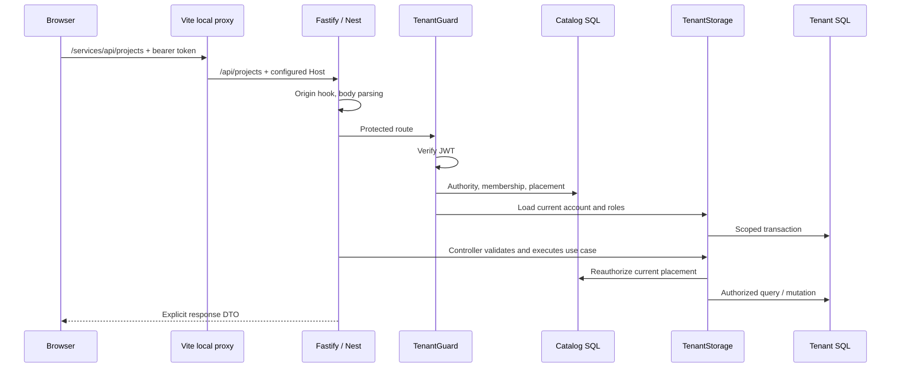

# NestJS backend: architecture reference

This reference describes the code in this directory, reviewed on 2026-09-29. It is a
parallel implementation of the .NET backend using NestJS, Fastify, Prisma and SQL Server.
Read this alongside [the parity ledger](docs/parity.md), which records incomplete areas.
A successful local login does not establish complete .NET parity or production readiness.

Paths below are relative to this folder unless they begin with `../`. Examples marked
**proposed** explain how to extend the design; they are not existing registered services.

## Architecture entry points

1. Run the local deployment and follow a login request in the API log.
2. Read `main.ts`, `bootstrap.ts`, `app.module.ts`, then `http/tenant.guard.ts` under `src/`.
3. Follow `CatalogReader` and `TenantStorage` into the two Prisma schemas.
4. Read one controller and its matching tests before adding a feature.
5. Study the cancellation, migration and operational limitations before changing storage.

## 1. Repository map: what lives where

| Location | Responsibility | Change it when… |
| --- | --- | --- |
| `src/main.ts` | Process entry, port validation and listen | Changing process startup |
| `src/bootstrap.ts` | Fastify adapter, limits, hooks, cookies and CORS | Changing HTTP-wide behavior |
| `src/app.module.ts` | Nest composition root and health routes | Registering providers/controllers |
| `src/http/auth.controller.ts` | Login, refresh, logout, token issuance | Changing authentication contracts |
| `src/http/tenant.guard.ts` | JWT verification and live authorization | Changing protected-request admission |
| `src/http/projects.controller.ts` | Project APIs, input helpers, membership helper | Changing project contracts |
| `src/http/project-members.controller.ts` | Project membership and assignment APIs | Changing project permissions |
| `src/http/tasks.controller.ts` | Task CRUD, board and assignment | Changing task use cases |
| `src/http/users.controller.ts` | User reads, updates and deactivation | Changing account administration |
| `src/http/read-models.controller.ts` | Dashboard and menus | Changing summary/navigation responses |
| `src/http/ai.controller.ts` | Description improvement endpoint | Changing that HTTP contract |
| `src/application/tenancy/` | Resolution, authorization and catalog port | Changing tenancy decisions |
| `src/application/worker/tenant-worker.ts` | Job fencing, admission and deduplication contracts | Adding a worker adapter |
| `src/domain/` | Tenant value objects, account rules, password format | Changing framework-independent rules |
| `src/infrastructure/prisma/` | Catalog access, storage routing and transactions | Changing persistence execution |
| `src/infrastructure/description-ai.ts` | Optional outbound AI integration | Changing provider behavior |
| `prisma/catalog.prisma` | System catalog mapping | Mapping catalog columns/relations |
| `prisma/tenant.prisma` | Tenant business table mapping | Mapping tenant columns/relations |
| `generated/` | Generated clients, ignored by Git | Regenerate; never hand-edit |
| `dist/` | Compiled JS and copied clients, ignored | Rebuild; never hand-edit |
| `scripts/seed-local-user.mjs` | Local test account enrollment | Changing local seed behavior |
| `localDeployment.ps1` | Local SQL provisioning and process startup | Changing local developer setup |
| `../Admin/` | Database creation/provisioning/migration owner | Changing physical storage |
| `../Frontend/React/` | Browser client and local HTTPS proxy | Changing browser behavior |

There is currently one Nest module, not a module per feature. Several controllers still
perform use-case orchestration and direct Prisma operations. This is a migration state,
not a fully enforced clean-architecture implementation. Domain/application tenancy code
is separated, but controller-to-infrastructure dependencies still exist.

The intended direction for substantial new work is thin HTTP controllers → application
commands/queries → domain rules, with infrastructure implementing application-owned ports.
Do not introduce a generic repository just to rename Prisma methods. Extract a focused
use case when it gives a concrete authorization, reuse or testing benefit.

## 2. First local run

Install the repository's .NET SDK, Node.js 24 or later, and Docker Desktop with Linux
containers. Package versions come from `package.json` and `package-lock.json`; use `npm ci`
after pulling dependency changes. The local script installs absent dependency directories,
but does not detect every stale existing installation.

```powershell
cd E:\Dev\DatavancedBD.AspNetCore.SmartTaskManagementSystem\NestJs
.\localDeployment.ps1
```

The script retains a generated local password in `.local/secrets.json`. To set a chosen
local password, use `-TestPassword` with your own value; this updates the seeded account
on each run. Do not put a real password in a committed script, document or shell transcript.

The default frontend is **https://localhost:5173**; the API is **http://127.0.0.1:3002**.
The seeded email is `accept0@example.test`. The API root `/` has no handler, so 404 there
is normal. Test `/alive` and `/ready` instead.

The script creates or reuses `nestjs-local-sql` on loopback port 56093 and retains its
named volume. It provisions the following local topology:

| Database | Purpose |
| --- | --- |
| `StmsNestCatalog` / `catalog` | Authority, membership and placement metadata |
| `StmsLocalNestDbA` / `dbo` | Database-isolated tenant A |
| `StmsLocalNestSchema` / `alpha` | Schema-isolated tenant |
| `StmsLocalNestRow` / `dbo` | Row-isolated tenant with SQL RLS |

These three bindings are a local demonstration. Production's requested nine-company
database-per-tenant deployment is separate configuration, never an application constant.
The script uses SQL `sa` to provision and run locally; that is not an acceptable production
runtime identity. Production runtime users must lack DDL/provisioning privileges and be
restricted to their authorized resources.

The script generates Prisma clients, builds, seeds the local user/role/membership, writes
`.env`, and starts hidden Node processes. It checks liveness, readiness and direct login.
Inspect `.local/logs/nestjs-api.log`, `.local/logs/nestjs-api.error.log`, `react.log`, and
`react.error.log` if startup fails. The frontend uses `--strictPort` so a port conflict does
not silently move it to a different origin.

Rerunning can stop Node listeners on the requested API/frontend ports. Reserve these ports
for this stack. It does not delete the SQL volume. `Admin local-init` handles creation of
empty local schemas; it is not an upgrade migrator for existing populated schemas.

### Why the browser uses a proxy

The script sets `VITE_API_BASE_URL=/services`, `VITE_DEV_API_TARGET=http://127.0.0.1:3002`
and `STMS_DEV_TENANT_AUTHORITY=a.accept.test:3002` in the frontend process environment.
The Vite proxy strips `/services` and supplies that configured authority to the API.
The browser stays on HTTPS localhost, where the Secure refresh cookie can be used.
No hosts-file modification is needed for this browser path.

The resolver compares exact authorities, including ports. `a.accept.test` and
`a.accept.test:3002` are distinct catalog entries. Changing the API port requires updating
deployment/catalog configuration; do not strip ports or add fallback tenants to fix a 401.
The proxy authority override is opt-in and must remain local configuration. This proxy
does not authorize a caller: membership, JWT tenant binding and resource checks still run.

## 3. Configuration and precedence

| Variable | Consumer and meaning |
| --- | --- |
| `PORT` | `main.ts`; default 8080, local script sets 3002 |
| `NESTJS_CUTOVER_ENABLED` | Readiness/protected-route rollout gate |
| `TENANT_REGION` | Reject placements outside this host's configured region |
| `JWT_ISSUER`, `JWT_AUDIENCE` | Issuance and verification contract |
| `JWT_KEY` | HS256 secret; minimum UTF-8 length checked at 32 bytes |
| `ALLOWED_ORIGINS` | Exact comma-separated browser origin allowlist |
| `SHARED_API_AUTHORITIES` | Optional authorities requiring an explicit tenant selector |
| `CATALOG_DATABASE_URL` | Prisma catalog connection, including `schema=catalog` |
| `TENANT_STORAGE_TARGETS` | JSON array of trusted logical storage targets |
| `TENANT_DATABASE_URL` | Tenant Prisma generation/seed tooling, not request routing |
| `NESTJS_TEST_TENANT_ID`, `NESTJS_TEST_EMAIL`, `NESTJS_TEST_PASSWORD` | Local seed input |
| `AI_ENABLED`, `GROQ_API_KEY`, `GROQ_MODEL`, `GROQ_ENDPOINT` | Optional outbound AI settings |

Storage target fields are `targetId`, `region`, `isolation` (0/1/2), `schema`,
`connectionString`, and `commandTimeoutSeconds`. The last value currently bounds the
interactive transaction duration; its name does not imply a driver-level statement cancel.
The factory appends an authorized schema to the configured connection string.

`npm start` simply runs compiled JavaScript; it does not automatically load `.env`.
For a manually configured process use `node --env-file=.env dist/src/main.js` from this
directory. Existing process environment values take precedence over Node's env file.
The deployment script explicitly sets child environment values to prevent stale ports or
JWT settings from overriding the file.

`.env` and `.local/` are private local state. Ignore rules prevent accidental Git additions;
they do not encrypt files or revoke already committed secrets. Use a secret manager in
production. Frontend `VITE_*` values are public configuration, never a place for SQL/JWT keys.

## 4. Startup and dependency injection

`main()` validates the port, calls `createApplication()`, then listens on `0.0.0.0`.
`bootstrap.ts` imports `reflect-metadata`, creates a `NestFastifyApplication` using
`FastifyAdapter`, installs hooks/cookies, and enables shutdown hooks.

Nest reads `@Module` metadata in `AppModule`. Controllers describe routes. Providers
describe injectable dependencies. For example, `TenantGuard` requests `CatalogReader`
and `TenantStorage` in its constructor; the container resolves those registered class
tokens rather than the guard opening a SQL connection itself.

`experimentalDecorators` and `emitDecoratorMetadata` in `tsconfig.json` support this
runtime metadata. TypeScript interfaces are erased and cannot themselves be injection
tokens. A proposed application port needs a runtime token, for example:

```typescript
// Proposed pattern; not an existing repository provider.
export const PROJECT_READER = Symbol('PROJECT_READER');
// In module providers:
// { provide: PROJECT_READER, useClass: PrismaProjectReader }
// In the use case:
// constructor(@Inject(PROJECT_READER) private readonly reader: ProjectReader) {}
```

Prefer constructor injection over service lookup. Register feature-module providers and
export only what another module genuinely needs. The current composition uses concrete
infrastructure classes, while tenant resolver/authorizer are constructed as small plain
objects with the catalog port passed explicitly.

Providers default to singleton scope. `CatalogReader` owns one catalog client;
`TenantStorage` caches clients by target and schema. Neither may store mutable current-user
or current-tenant state. That state belongs to the request and immutable `TenantContext`.
Nest request scope creates a per-request DI subtree and can propagate to consumers;
transient scope creates instances per consumer. Neither is automatically necessary for
safe tenant isolation. See [Nest injection scopes](https://docs.nestjs.com/fundamentals/injection-scopes).

`onModuleDestroy()` disconnects owned Prisma clients. Shutdown hooks allow Nest to invoke
lifecycle cleanup on supported process signals. Windows force-kill is not a graceful
shutdown protocol; do not use the local script's forced stop as the production drain design.

## 5. HTTP pipeline: hooks, middleware, guards and validation



Fastify owns the low-level HTTP lifecycle. This project installs an `onRequest` hook for exact-origin CORS. Cookies use `@fastify/cookie`. There are
no custom Nest middleware classes, global ValidationPipe, global interceptor chain or
custom exception filter registered today. Only the components registered in the composition root participate in this host.

Conceptually, Nest middleware precedes guards; guards decide route admission; interceptors
can wrap execution; pipes parse/validate arguments; controllers execute; exception filters
handle uncaught exceptions. Interceptor return processing unwinds after the handler.
Fastify hooks surround adapter-specific phases; do not indiscriminately install Express
middleware in this Fastify host. See [Nest request lifecycle](https://docs.nestjs.com/faq/request-lifecycle).

The Fastify adapter currently limits bodies to 64 KiB, sets a 30-second request timeout and
disables trust in forwarded headers. A request timeout is not a universal database deadline.
CORS checks exact origins and handles OPTIONS with credentials and a limited header/method
allowlist. CORS is browser policy, not API authentication.

Validation is manual. Inputs enter as `unknown` or records, then helpers narrow types and
construct approved objects. `positiveId()` rejects malformed IDs; `page()` defaults to
20 and caps page length at 200. Project validation checks name/description length, real
calendar dates and date ordering. Sort fields are mapped through an allowlist.

A TypeScript DTO type alone does not validate runtime JSON. If adding class-validator
and a global pipe later, introduce dependencies, DTO classes and compatibility tests
deliberately. Preserve current error/status contracts. Avoid spreading request bodies
into Prisma `data`; that can turn a newly added database field into writable API surface.

Nest exceptions such as BadRequestException, UnauthorizedException, ForbiddenException
and NotFoundException map to HTTP errors. Infrastructure failures still need careful
mapping and redaction; not every database failure has a domain-specific error today.

## 6. Login, JWT, cookies and live authorization

Login requires an allowed `Origin` and a catalog-recognized `Host`. The controller validates
email/password shapes, trims and uppercases the email for lookup, resolves the candidate
placement, opens tenant storage, verifies the password and checks active catalog membership.
It also checks lockout and current roles before issuing tokens.

`domain/identity-password.ts` reads ASP.NET Identity V2/V3 hashes. New local hashes use
PBKDF2-HMAC-SHA512 with a random salt and 100,000 iterations in the Identity V3 binary
format. Comparison uses `timingSafeEqual`. Passwords are not JWT payloads and are never
stored as plaintext in tenant tables.

`jose` signs an HS256 access token with `sub`, issuer, audience, `tenant_id`, role claim,
issued-at and a 30-minute expiry. Signing authenticates a token; it does not encrypt its
payload. The refresh token is random opaque data. Only its SHA-256 hash is stored in SQL.
The cookie is HttpOnly, Secure, SameSite=None, path `/`, with a seven-day lifetime.

Refresh checks origin, placement, membership, account state and stored token validity. It
revokes the old token conditionally and issues a replacement inside the tenant transaction.
Logout revokes the matching refresh token and clears the cookie. Access JWTs are not
automatically blacklisted by logout; their finite lifetime and live account/membership
checks remain relevant. A complete credential-compromise revocation design needs explicit
policy, not merely deleting a browser token.

`TenantGuard` verifies signature, allowed HS256 algorithm, issuer and audience, and validates
subject/tenant claims. `jose` validates time claims when present. The issuer sets expiry on
its tokens; the guard does not currently declare a separate required-claims list requiring
`exp` on every externally issued token. It resolves the request authority and independently
checks membership, region, active lifecycle and placement. Current account roles are read
from SQL rather than blindly trusting stale role claims.

Resource authorization still happens in controllers: membership in a tenant is not access
to every project/task. The immutable context binds all operations to one tenant. Registration
and user creation deliberately return Forbidden until secure catalog enrollment exists.
User deletion deactivates the account and revokes refresh tokens, preserving related history.

The React store keeps the access token in memory and restores it through the refresh route.
The shared Axios client adds the bearer token and uses credentials for cookies. A full
browser reload exercises refresh; testing login alone misses cookie/origin failures.

## 7. Tenant resolution and storage boundaries

An authority is untrusted input. `TenantRequestResolver` validates DNS-style syntax and
performs an exact catalog lookup. A configured shared authority requires `X-Tenant-ID`;
that selector is still subject to membership and token binding. Conflicting selectors,
unknown authorities and missing placements fail closed. There is no legacy/default fallback.

Catalog tables are separate from tenant business tables:

| Catalog model | Meaning |
| --- | --- |
| `TenantAuthority` | Exact authority → tenant, with active flag |
| `TenantPlacement` | Isolation, logical target, schema, region, version and lifecycle |
| `TenantMembership` | Tenant + issuer + subject membership, with active flag |

`TenantStorage.execute()` reauthorizes the context before opening a transaction. Candidate
execution exists for login, when there is no authenticated access token yet; it rechecks
placement and relies on login's password/membership checks. Do not use candidate execution
as a shortcut for protected business endpoints.

Placement references trusted logical targets. Client input never becomes a connection
string or schema. Database isolation uses the target's database; schema isolation uses
the validated placement schema; row isolation uses a shared schema with tenant keys/RLS.
Cached Prisma clients are partitioned by target/schema, not by a mutable global tenant.

Row operations use a pinned interactive transaction. The service sets SQL SESSION_CONTEXT
`TenantId`, checks that the expected enabled RLS policy has filter and write predicates,
executes application work, and clears context in `finally`. Composite keys and explicit
tenant predicates remain necessary for every strategy. RLS is additional defense; merely
putting `tenantId` in a TypeScript object does not enforce isolation.

## 8. Prisma model configuration and SQL execution

Two generated clients keep system metadata and business schemas distinct. `@map` binds a
field to an existing SQL column, `@@map` binds a model to a table, and `@db.*` describes a
SQL Server native type. `@@id([tenantId, id])` creates a compound client lookup shape.

For example, tenant-scoped user access uses:

```typescript
const user = await db.user.findUnique({
  where: { tenantId_id: { tenantId, id: userId } },
  select: { id: true, email: true },
});
```

That shape comes from `tenant.prisma`; it is not a hand-written repository method. Relations
also carry `tenantId` in both foreign and referenced keys, preventing cross-tenant links.
`onDelete: NoAction` / `onUpdate: NoAction` are deliberate relation settings. Do not add
cascades without checking the existing SQL schema and tenant data lifecycle.

The tenant schema maps Users, Roles, UserRoles, Identity claims/logins/tokens, Projects,
ProjectTasks, UserProjects, UserTasks, RefreshTokens and MenuItems. SQL Date, DateTime2,
DateTimeOffset, UniqueIdentifier and nvarchar types are explicitly mapped where needed.
Catalog placement revision is `bigint`; JavaScript Number cannot exactly represent all
SQL bigint values, and JSON.stringify cannot serialize a bigint directly.

Prisma generation is code generation, not a migration:

```powershell
npm run prisma:validate:catalog
npm run prisma:validate:tenant
npm run prisma:generate:catalog
npm run prisma:generate:tenant
npm run build
```

Supply private environment URLs where validation requires them. `build` runs TypeScript
and copies the already-generated clients into `dist/generated`; `localDeployment.ps1`
generates them first. Generated native engines are platform-dependent; a Windows client
artifact is not evidence that a Linux container can run it.

Use `select` to return only needed fields and map public DTOs deliberately. Bound list
queries; avoid N+1 lookups. Use the `db` passed to the transaction callback for every
statement in that unit of work. Calling a root client inside the callback may escape its
transaction. A Prisma transaction client must not be retained after the callback returns.

Tagged `$queryRaw` / `$executeRaw` bind values as parameters. Table/schema names cannot
be parameterized as values; resolve identifiers only from trusted configuration. Never
concatenate client input into SQL. `Promise.all` inside one transaction does not create
multiple database connections or guarantee parallel SQL execution.

Prisma's native engine manages its own SQL I/O and pooling. It is inaccurate to say every
Prisma operation runs on a Node worker thread. Pool counts multiply across targets and API
replicas, so size them with SQL limits and observed load in mind.

## 9. Migrations: who owns the database

**Admin owns DDL in this repository. Prisma describes the existing schema.** There is no
NestJS Prisma Migrate history that can safely be applied as the authoritative production
schema. Do not run `prisma db push`, `migrate reset` or `migrate dev` on deployed databases.

The .NET model/configuration, catalog SQL baselines, RLS scripts and migration orchestration
must agree with Prisma mappings. Filtered indexes, computed columns such as SearchVector,
RLS policies, collation-sensitive checks and migration history are not completely described
by the Prisma models. See [Prisma SQL Server caveats](https://docs.prisma.io/docs/orm/v6/overview/databases/sql-server).

For a schema change:

1. Identify the owning Admin/EF model and all affected storage strategies.
2. Design an additive, versioned Admin migration with defaults/backfill and rollback notes.
3. Test on a copy of representative existing data, not only an empty database.
4. Update Prisma mappings and regenerate both affected build/runtime artifacts.
5. Update use cases, DTOs and contract tests independently of persistence types.
6. Deploy compatible readers/writers, perform bounded backfill, then remove old columns
   only in a later release after usage and recovery are verified.

Catalog placement activation must follow completed provisioning. Moving a tenant needs
fencing of old revisions and a recovery plan. Neither changing `schema=` in a URL nor
restarting the API migrates data. `Admin/LocalTenantBootstrap.cs` explicitly targets fresh
local schemas; existing-table detection does not prove schema currency.

The parity ledger documents catalog BIN2/identifier and membership collation issues.
Do not silently alter those checks through a generated Prisma migration to make a test pass.

## 10. AbortSignal, deadlines and request lifetime

HTTP disconnects deliberately do **not** propagate cancellation to database calls in
this implementation. Closing a browser tab or cancelling a client request does not abort
the server transaction. It may finish and commit after the client has disconnected; a
client retry must not assume that the original mutation failed.

The tenancy application contracts accept `AbortSignal` and check it cooperatively.
Current HTTP callers create independent, non-aborted signals; they are not connected to
socket events. `TenantStorage` uses ordinary Prisma transactions without a cancellation
extension. Its configured transaction timeout remains in effect.

`AbortController.abort()` changes signal state and dispatches an abort event; it is not
a thread interrupt, process kill or SQL command. `throwIfAborted()` throws only when code
reaches that check. APIs such as fetch can observe a supplied signal and cancel their own
work. A promise by itself has no general cancellation mechanism, and `Promise.race` does
not stop the losing operation. Prisma 6's native SQL Server query API has no supported
AbortSignal argument for interrupting an executing SQL statement.

The optional AI integration uses its own five-second timeout and fallback. Background
job signals and process shutdown are separate lifecycles from an HTTP connection. Review
each adapter's actual behavior rather than assuming a signal cancels every dependency.

## 11. Node.js internals: from packets to your controller

Nest is an application framework, Fastify is the HTTP adapter, Node is the runtime,
V8 executes JavaScript, and libuv supplies event-loop/platform I/O machinery. They are
different layers. Nest does not allocate a JavaScript thread for each incoming request.

### V8 does not directly receive network-card interrupts

Hardware events are handled by the OS/kernel and device drivers. User-space readiness or
completion facilities notify runtime I/O code. libuv uses mechanisms such as epoll on
Linux and IOCP on Windows. Node's bindings arrange JavaScript callbacks; V8 then executes
them when the event loop can run. A network response does not asynchronously interrupt
the middle of your controller's JavaScript statement. See the
[libuv design](https://docs.libuv.org/en/v1.x/design.html).

```text
Network / device → kernel I/O → platform readiness/completion
  → libuv / runtime callback → Node HTTP → Fastify → Nest handler
  → promise settles → JavaScript continuation
```

OS process signals such as SIGTERM are another mechanism, delivered through runtime signal
handling; they are neither AbortSignal nor hardware interrupts. V8 also has engine-internal
interrupt/safepoint mechanisms used by its embedder and engine. Those are not a supported
application-level way to cancel a database query.

V8 parses and compiles JavaScript, runs execution tiers and manages a garbage-collected heap.
Node embeds it and supplies I/O APIs. Long synchronous work or expensive allocation can
delay unrelated requests; asynchronous syntax alone does not eliminate that cost. See
[V8 documentation](https://v8.dev/docs).

### Event loop and promises

The event loop has phases for timers, pending callbacks, polling I/O, check callbacks and
close callbacks. Promise continuations run through microtask processing; `process.nextTick`
uses a Node-specific queue. Avoid relying on casual timer-order assumptions, especially
across CommonJS/ESM and runtime versions. Timers specify a threshold, not a hard real-time
deadline. See [Node event loop](https://nodejs.org/learn/asynchronous-work/event-loop-timers-and-nexttick).

For this code, `await db.project.findMany(...)` yields while the query is outstanding.
When it resolves, the continuation validates/maps results. Another request can run while
the first is waiting. Shared singleton mutable fields would therefore race across awaits
even though their JavaScript statements are not executing simultaneously on one isolate.

An `async` function that sorts a million rows before its first await still blocks. Repeated
`await Promise.resolve()` may keep work in microtasks rather than yielding fairly to I/O.
Use bounded input, database-side filtering/pagination and measured CPU offload.

### Three different meanings of worker

| Mechanism | What it does | Repository relevance |
| --- | --- | --- |
| libuv thread pool | Native operations such as asynchronous PBKDF2 and filesystem work | Password derivation uses async `crypto.pbkdf2` |
| `node:worker_threads` | Separate JS isolates/threads for CPU work | No worker_threads pool is configured here |
| Application worker | Durable/business background-job orchestration | `TenantWorker` is an adapter-driven logical worker |

Do not increase worker-pool size without measurements: it consumes resources and may move
the bottleneck elsewhere. A worker thread is useful for substantial JavaScript CPU work,
not automatically for socket I/O. Async password hashing avoids blocking the main JS
thread but still consumes CPU capacity. Login needs rate/admission limits before production.
See [Node guidance on blocking](https://nodejs.org/learn/asynchronous-work/dont-block-the-event-loop).

## 12. Application worker behavior

`TenantWorkItem` includes tenant, target, placement revision and access identity.
`TenantWorker` receives queue, deduplicator, admission, authorizer and handler adapters;
it is not currently a registered durable worker host. It bounds in-flight promises,
namespaces deduplication by tenant/job and reauthorizes at execution time.

Stale placements and access denial are acknowledged without executing business work.
Other failures abandon for retry according to the adapter contract; production retry
classification, dead-letter policy and durable deduplication still need implementation.
Cancellation propagates while cleanup uses separate signals. Cleanup itself needs bounded
deadlines in real adapters. No implementation here proves exactly-once external effects.

Do not enqueue request objects or Prisma transaction clients. Serialize a tenant-bound job
contract, reauthorize later, and open fresh storage scope. For reliable external publication,
design a tenant transaction outbox and idempotent consumer before claiming durable delivery.

## 13. Feature and schema change workflow

For a project-label change, define the API contract: required or
optional, maximum length, edit permission, default, list/filter behavior and old-client
compatibility. Find the existing project controller and corresponding .NET contract.

If persistence changes, follow the Admin migration sequence above, then add the Prisma
mapping and regenerate. Add a focused runtime validator that returns a narrow approved
input object. Keep domain invariants independent of HTTP where possible.

For a protected route, use `@UseGuards(TenantGuard)` and `requireContext(request)`. Execute
through `storage.execute(context, async db => { ... })`. Include
tenant predicates, resource membership checks and explicit response projection. Do not
accept tenant ID, target ID, owner ID or role from a request body as authorization.

For substantial logic, extract an application handler and register its provider in the
composition root. Use an application port only where it captures a real boundary. Keep
external effects outside SQL transactions unless recorded as outbox intent.

Tests should cover valid behavior, invalid fields, unauthorized roles/resources, two tenants
with colliding IDs, cancellation, and rollback. Exercise changed SQL constraints on real
SQL Server. Update the parity ledger and frontend error/loading behavior before completion.

## 14. Tests, debugging and troubleshooting

```powershell
# NestJs working directory
npm ci
npm run prisma:generate:catalog
npm run prisma:generate:tenant
npm run lint
npm test
npm run format:check
```

`npm test` compiles and runs `dist/test/*.test.js`. Unit tests are separate from real SQL
isolation evidence. HTTP disconnect cancellation is intentionally not implemented.

`npm run test:sql` runs `*.acceptance.js` and requires `SAAS_TEST_CATALOG_URL`,
`SAAS_TEST_DATABASE_URL`, `SAAS_TEST_SCHEMA_A_URL`, `SAAS_TEST_SCHEMA_B_URL`, and
`SAAS_TEST_ROW_URL`. It expects dedicated disposable fixtures, including an initially empty
catalog. Do not point it at the populated interactive local deployment just because the
database names look familiar. Inspect its setup/cleanup before running it.

The React project has lint/build scripts but no automated component-test script today.
Do not report a passing React `npm test`. Use its locked manifest and the actual scripts.

| Symptom | First investigation |
| --- | --- |
| Connection refused | API process, requested port, startup logs |
| `/ready` 503 | Cutover flag, auth config, target parsing, catalog connection |
| Login 401 / incorrect credentials | Exact authority including port, actual seeded password, membership, lockout and roles |
| Protected route 403 | JWT tenant binding, live membership/placement, resource permission |
| Browser fails but curl succeeds | HTTPS proxy, Origin, cookies, actual frontend base URL |
| Reload loses login | Refresh cookie, refresh endpoint, rotation/replay response |
| `EADDRINUSE` | Port owner; do not indiscriminately kill every Node process |
| Prisma DLL locked on Windows | Stop this API before regenerating/copying engines |
| PowerShell npm errors | Use `npm.cmd`; inspect the real exit code/output |
| SQL TLS/permission failure only in an agent shell | Compare approved host execution with restricted shell; do not weaken production TLS |

Fastify logs request IDs; authorization/cookie headers are redacted. Do not add passwords,
SQL URLs or access tokens to logs while debugging. Some Prisma error messages may include
query arguments, so redacted HTTP logging alone is not a complete observability policy.

## 15. Production gaps and safe change boundaries

Before production cutover, address complete endpoint parity, per-user/tenant rate limits,
driver-level cancellation if required, durable worker adapters, caches/invalidation,
concurrency conflict contracts, migrations on existing data, recovery drills and telemetry.
The current readiness probe checks the catalog and configuration; it does not prove every
tenant database can serve traffic.

Review the Dockerfile separately: its present build does not explicitly generate/copy the
source Prisma clients before `npm run build`, and its runtime copies the dependencies
directory rather than pruning dev dependencies. The current image is therefore not a
verified production delivery path. A multi-stage file and non-root UID alone do not prove
a working minimal image. Keep secrets out of image contexts and verify Linux engines.

For any significant storage/security/deployment decision, add an ADR under `../docs/adr/`
with alternatives, consequences, migration and rollback. Read `../docs/Multitenancy.md`
and the repository's AGENTS.md before changing tenant boundaries. Prefer a small verified
change over silently weakening a check to make the local UI succeed.
