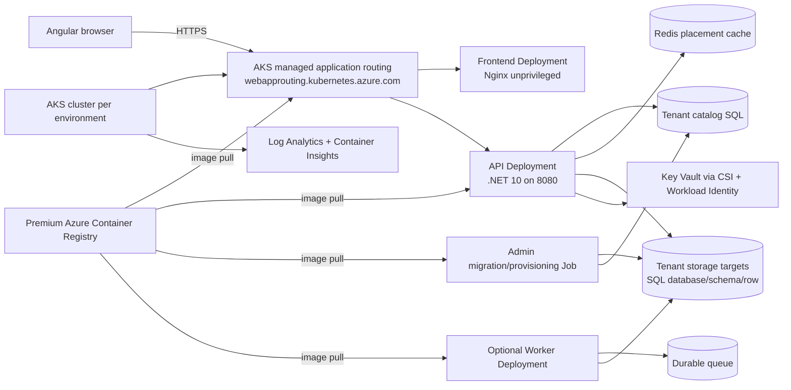

# Smart Task Management System

Production-oriented SaaS deployment for the Smart Task Management System. The application is a .NET 10 backend with an Angular 21 frontend. This README is the entry point; the detailed developer reference is [docs/DEVELOPER_WIKI.md](docs/DEVELOPER_WIKI.md).

The repository contains the AKS and GitHub Actions implementation, but it does not claim that an Azure subscription has already been deployed or that the application-specific production integrations are complete. An operator must supply the external SQL/Redis services, identities, DNS, secrets, GitHub Environment configuration, and release approvals described below.

## Status and boundaries

For the reproducible nine-company local Docker environment (one dedicated, three schema,
five shared-row companies), see [local SaaS acceptance](deploy/local/README.md).

Implemented in this repository:

- Organization-level tenancy primitives: immutable placement validation, cache-first catalog resolution, durable SQL compare-and-set writes, Redis publication, authority and membership checks, and generation-fenced browser organization context.
- Storage routing for dedicated database, schema, and row isolation, including composite tenant keys, write guards, and generated row-level-security support.
- Separate `Admin` migration/provisioning commands and a bounded, tenant-fenced `Worker` process.
- Rootless API, Admin, Worker, and Angular container images.
- AKS infrastructure in Bicep for separate `dev` and `prod` resource groups.
- Azure Key Vault CSI Provider with AKS Workload Identity, managed application routing, cert-manager, Azure RBAC, Azure CNI Overlay, network policy, autoscaling, and Container Insights.
- GitHub Actions CI, automatic dev delivery, and manually approval-gated production promotion using immutable image tags and digests.

Deliberate release prerequisites and limitations:

- The Bicep modules do not create Azure SQL, Azure Cache for Redis, DNS records, or GitHub Environments. Their endpoints and permissions must be provided by the platform owner.
- Web startup does not run migrations, enumerate tenant targets, or seed sample accounts. Existing databases must be initialized through the reviewed Admin path.
- The Helm chart builds, signs, scans, and validates the Worker image, but `worker.enabled` is `false` by default. The current application requires a real `ITenantWorkHandler` and durable queue adapter before the Worker should be enabled.
- The local `LocalDocker` composition uses the tenant-aware EF and Identity stores for every company API. Production AKS still uses the external catalog, authority, membership, and target configuration contracts.
- Application Insights resources remain available in Azure infrastructure, while the local and container observability path uses Loki for logs, Tempo for traces, and Prometheus for metrics.
- Focused unit tests and static validation are not evidence of live SQL, Redis, Azure RBAC, network, or production-isolation acceptance. Complete the environment-gated acceptance checks before declaring a production release ready.

## Architecture overview



At runtime, the browser reaches one HTTPS host. The managed application-routing add-on serves the Angular frontend at `/` and routes `/services/api/...` to the API, rewriting it to the API's `/api/...` route space. The frontend is not a trusted tenancy boundary: the API authenticates the caller, validates the organization context, checks authority and membership, resolves an active placement, and only then permits tenant persistence.

The API and Admin process receive secret values through Key Vault-backed Kubernetes Secrets populated by the Azure Key Vault CSI Provider. Workload Identity exchanges the pod service-account token for the user-assigned managed identity; no client secret is placed in a pod, Helm value, image, or workflow file.

### Runtime components

| Component | Responsibility | Current deployment behavior |
| --- | --- | --- |
| Angular frontend | Browser UI and organization context selection | Three-replica baseline in prod, Nginx on port 8080, served through the shared HTTPS host |
| API | Authentication, authorization, catalog resolution, tenant-aware HTTP composition, application features | .NET 10 deployment on port 8080 with `/alive` and `/ready` probes |
| Admin | Reviewed migrations and tenant provisioning | Helm pre-install/pre-upgrade Job runs `Admin.dll migrate` when enabled |
| Worker | Tenant-scoped background processing | Image is supplied; chart is disabled until a durable queue and `ITenantWorkHandler` are supplied |
| Tenant catalog SQL | Durable placement, authority, and membership data | External dependency; connection string comes from Key Vault |
| Redis | Versioned placement cache and bounded read path | Cache only; it is never the authoritative tenant source |
| Tenant storage targets | Organization data using database/schema/row isolation | External dependency; target bindings come from reviewed configuration and catalog data |
| Azure Key Vault | Secret storage | One vault per environment, RBAC enabled, soft delete enabled, purge protection enabled by default in prod |
| Azure Container Registry | Immutable application image storage | One shared Premium registry, admin login disabled, anonymous pull disabled |
| Log Analytics / Container Insights | Cluster and container log collection | `omsAgent` is enabled in each AKS cluster |
| Grafana/Loki | Structured application log storage and querying | Loki sink is enabled by `Observability__Loki__Endpoint`; Grafana Compose provisioning is supplied for local and container use |
| Grafana Tempo | Distributed trace storage and search | API OTLP traces are sent to Alloy and forwarded to Tempo |
| Prometheus | Metrics storage and query | API OTLP metrics are converted by Alloy and written through Prometheus remote write |
| Application Insights | Azure monitoring resource reserved for application telemetry | Created and linked to Log Analytics; application exporter wiring is not currently enabled |

## Organization isolation model

`TenantId` identifies the purchasing organization. Departments and teams are business entities inside an organization; they are not independent storage tenants.

| Organization tier | Storage placement | Isolation boundary |
| --- | --- | --- |
| Large | Dedicated organization database | Database |
| Medium | Shared database group, one schema per organization | Schema plus tenant-aware model and authorization checks |
| Small | Shared database and schema | `TenantId` on the row, composite keys/filters, write guards, and database RLS support |

Placement is durable in the tenant catalog. Redis stores versioned placement payloads for fast reads and outage fallback, but cache contents do not establish authority. A request must still pass the organization-bound claim, authority, membership, active-placement, and cancellation/deadline checks before tenant persistence is selected.

The browser organization store is in memory, validated, and generation-stamped. It does not persist placement, credentials, or organization state in local storage. API interception is a separate composition unit and must not be treated as an authorization mechanism.

## Azure resource topology

The default parameter files create the following logical topology in `southeastasia`:

| Scope | Dev | Prod |
| --- | --- | --- |
| Shared resource group | `stms-shared-rg` | `stms-shared-rg` |
| Container Registry | `stmsplatformacr` | same shared registry |
| Environment resource group | `stms-dev-rg` | `stms-prod-rg` |
| AKS cluster | `stms-dev-aks` | `stms-prod-aks` |
| Key Vault | `stms-dev-kv` | `stms-prod-kv` |
| Log Analytics | `stms-dev-law` | `stms-prod-law` |
| Kubernetes namespace | `stms-dev` | `stms-prod` |
| Helm release | `stms` | `stms` |
| Default ingress host | `stms-dev.example.com` | `stms.example.com` |
| System node autoscaler | 1–3 nodes | 2–4 nodes |
| User node autoscaler | 1–4 nodes | 2–8 nodes |
| Node zones | Region default | Zones 1, 2, and 3 |
| Log retention | 30 days | 90 days |
| Key Vault purge protection | Off by default | On by default |

These names are defaults, not globally guaranteed names. Change the parameter files and GitHub variables together if your organization uses different names. Azure resource names and availability-zone support must be validated in the selected region before deployment.

### AKS controls

The `Azure/infra/aks.bicep` module configures:

- System-assigned AKS identity, managed Microsoft Entra integration, Azure RBAC for Kubernetes, local Kubernetes accounts disabled, and optional Entra administrator group IDs.
- OIDC issuer and Workload Identity for the API, Worker, and Admin service accounts.
- Azure Key Vault Secrets Provider with secret rotation polling set to two minutes.
- AKS managed application routing (`webAppRouting`) and its `webapprouting.kubernetes.azure.com` ingress class.
- Container Insights through the `omsAgent` add-on, sending cluster/container logs to the environment Log Analytics workspace.
- Azure CNI Overlay networking, Azure network policy, Standard Load Balancer, one managed outbound IP, and separate system/user Azure Linux VM scale-set pools.
- Cluster autoscaler with balanced node groups and conservative scale-down settings, plus pod-level HPA/PDB controls in Helm.
- Stable AKS control-plane upgrade channel and `NodeImage` node OS upgrade channel.
- A public API server by default. `authorizedApiServerIpRanges` defaults to an empty array, which means the control plane is not IP-restricted until operators provide an allowlist. Supply approved build-agent and operator egress IPs before production use; private-cluster networking is not enabled by this module.

The AKS managed application-routing add-on is the current edge implementation in this repository. Its controller is Microsoft-managed and exposes the `app-routing-system/nginx` service that the add-on script waits for. Microsoft documents the add-on and the Gateway API path in [AKS application routing](https://learn.microsoft.com/en-us/azure/aks/app-routing) and [AKS Gateway API support](https://learn.microsoft.com/en-us/azure/aks/app-routing-gateway-api). Review that lifecycle before adopting a long-lived new platform; the chart should eventually be migrated to a supported Gateway API/Application Gateway for Containers design if the managed NGINX path no longer meets the platform roadmap.

### TLS and DNS

`deploy/aks/deploy-addons.sh` installs cert-manager at the pinned default chart version `v1.21.1`, waits for the AKS managed routing service, and creates a ClusterIssuer. Dev uses the Let's Encrypt staging directory; prod uses the production directory. The Helm ingress resources use HTTP-01 and the managed routing ingress class.

Before a first release:

1. Create an A record for the chosen `INGRESS_HOST` pointing to the external IP of the `app-routing-system/nginx` Service.
2. Use a real DNS name and a valid email address. The `example.com` values in this repository are placeholders.
3. Keep dev on the staging ACME endpoint until DNS and routing are proven. Production certificates have Let's Encrypt rate limits.
4. Verify that the network policy permits the cert-manager HTTP-01 solver, as defined in the chart.

The API route is exposed as:

```text
https://<INGRESS_HOST>/services/api/<route>
```

The ingress rewrites that to:

```text
http://stms-api:8080/api/<route>
```

## Repository map

| Path | Purpose |
| --- | --- |
| `Application/Tenancy` | Provider-independent catalog, resolution, context, migration, and provisioning contracts |
| `Api/Tenancy` | Opt-in HTTP policy composition; authenticate and authorize before tenant persistence |
| `Infrastructure/Tenancy/Catalog` | Cache-first catalog decorator, durable Azure SQL adapter, and external DI composition |
| `Infrastructure/Tenancy/Authorization` | Authority and membership readers with bounded, fail-closed checks |
| `Infrastructure/Tenancy/Caching` | Redis placement adapter and transport classification; never authoritative |
| `Infrastructure/Tenancy/Persistence` | Dynamic targets, database/schema/row strategies, composite isolation, write guards, and RLS boundaries |
| `Infrastructure/Tenancy/Migrations` | Out-of-band migration orchestration |
| `Infrastructure/Tenancy/Provisioning` | Allocate, migrate, validate, and activate organizations |
| `Admin` | Explicit migration and provisioning process |
| `Worker` | Separate tenant-scoped background process |
| `Infrastructure.Tests/Tenancy` | Focused unit tests and opt-in live-provider acceptance tests |
| `Frontend/Angular/src/app/core/tenancy` | Browser organization context, API allowlist, and generation-fenced interceptor |
| `Azure/infra/shared.bicep` | Shared Premium ACR and optional CI push role |
| `Azure/infra/aks.bicep` | Environment AKS, networking, Key Vault, identities, monitoring, and RBAC |
| `Azure/infra/parameters/aks-dev.json` | Dev infrastructure values |
| `Azure/infra/parameters/aks-prod.json` | Prod infrastructure values |
| `deploy/aks/deploy-infrastructure.sh` | Resource group and Bicep deployment wrapper |
| `deploy/aks/deploy-addons.sh` | Managed-routing readiness, cert-manager, and ClusterIssuer setup |
| `deploy/aks/sync-keyvault-secrets.sh` | Writes required application secrets to the environment Key Vault |
| `deploy/aks/build-images.sh` | Buildx builds and pushes API/Admin/Worker/frontend images |
| `deploy/aks/deploy-release.sh` | Digest resolution, Helm lint, atomic release, and smoke check |
| `deploy/aks/health-check.sh` | Rollout checks plus API `/alive` and `/ready` checks |
| `deploy/aks/chart` | Reusable Helm chart and dev/prod value overlays |
| `.github/workflows/ci.yml` | PR/push build, test, container build, Helm lint, and Bicep build |
| `.github/workflows/dev-cicd.yml` | Automatic dev provisioning, image publication, signing, scanning, and deployment |
| `.github/workflows/prod-cd.yml` | Manual, approval-gated promotion of a dev image tag to prod |
| `Azure/GitHubActionsOIDCSetup.md` | Detailed Entra OIDC bootstrap notes |
| `deploy/configuration/README.md` | Configuration boundary and ownership rules |

## Configuration ownership

Use this ownership model when deciding where a value belongs:

| Data | System of record | Delivery mechanism |
| --- | --- | --- |
| Tenant placement, authority, membership | Tenant catalog SQL | Application provider and Admin workflow |
| Cached placement | Redis | Cache-first catalog adapter; bounded expiry and version checks |
| Tenant data | Configured SQL targets | Admin-reviewed provisioning/migration plus tenant-aware persistence |
| Passwords, JWT material, connection strings, API keys | Azure Key Vault | CSI Provider, Workload Identity, and synced Kubernetes Secret |
| Nonsecret runtime policy | Helm values/ConfigMap | Chart release configuration; no secret values in values files |
| Image provenance | ACR digest and Cosign signature | GitHub Actions build once, then promote |
| Application telemetry | Loki for logs, Tempo for traces, Prometheus for metrics; Container Insights/Log Analytics also collects stdout | API pushes logs directly to Loki and OTLP traces/metrics to Alloy, which forwards to Tempo and Prometheus; console exporters remain diagnostic fallbacks |

No tenant inventory, database credential, JWT key, API key, or sample password belongs in source, a container image, workflow YAML, or Helm values. The configuration boundary is described in [deploy/configuration/README.md](deploy/configuration/README.md).

### Key Vault secret contract

`deploy/aks/sync-keyvault-secrets.sh` writes these names. The runtime and Admin SecretProviderClasses map them to the corresponding .NET environment keys:

| Key Vault secret | .NET configuration key | Required |
| --- | --- | --- |
| `DefaultConnection` | `ConnectionStrings__DefaultConnection` | Yes |
| `StorageTargetSharedConnection` | `Saas__Storage__Targets__shared__ConnectionString` | Yes; defaults to the default connection in the sync script if not separately supplied |
| `JwtIssuer` | `Jwt__Issuer` | Yes |
| `JwtAudience` | `Jwt__Audience` | Yes |
| `JwtKey` | `Jwt__Key` | Yes |
| `GroqApiKey` | `Ai__GroqApiKey` | Yes while AI is enabled |
| `RedisConnection` | `Caching__Redis__ConnectionString` | Yes |
| `TenantCatalogSqlConnection` | `Saas__TenantCatalog__Sql__ConnectionString` | Yes |
| `TenantCatalogRedisConnection` | `Saas__TenantCatalog__Redis__ConnectionString` | Yes; defaults to the Redis connection in the sync script if not separately supplied |

The CSI driver rotates mounted values, but a process that consumes the synced Kubernetes Secret through environment variables does not automatically receive a new environment block. Restart or perform a Helm release after rotating a secret, then run the smoke check.

### Nonsecret Helm configuration

The chart generates a ConfigMap containing, among other values:

```text
ASPNETCORE_ENVIRONMENT
Caching__Provider
Caching__Redis__InstanceName
Caching__Redis__ConnectRetry
Caching__Redis__ConnectTimeoutMilliseconds
Caching__Redis__SyncTimeoutMilliseconds
Saas__TenantCatalog__Cache__KeyPrefix
Saas__TenantCatalog__Read__CommandTimeoutSeconds
Saas__TenantCatalog__Read__DeadlineSeconds
Saas__TenantCatalog__Redis__Database
Saas__Storage__Targets__<targetId>__Isolation
Saas__Storage__Targets__<targetId>__Region
Saas__Storage__Targets__<targetId>__Schema
Saas__Storage__Targets__<targetId>__MaxPoolSize
Saas__Storage__Targets__<targetId>__CommandTimeoutSeconds
Ai__Enabled
Ai__GroqEndpoint
Ai__Model
Cors__AllowedOrigins__0
Saas__Tenancy__SharedApiAuthorities__0
```

The default chart storage target is `shared`, with row isolation, `southeastasia`, schema `dbo`, pool size `100`, and a 30-second command timeout. These are deployment defaults, not a substitute for reviewing the catalog and target capacity model.

## Prerequisites

For Azure and GitHub deployment, prepare:

- An Azure subscription and a Microsoft Entra tenant in the Azure public cloud.
- Azure CLI with Bicep support (`az bicep`), Helm 3, `kubectl`, `kubelogin`, Bash 4+, `curl`, and Docker Buildx for local image builds.
- A region where the selected VM SKU, Kubernetes version, and availability zones are available. The supplied defaults use `southeastasia`.
- An externally managed Azure SQL topology for the tenant catalog and storage targets, and an externally managed Redis service for the catalog/cache paths. Confirm firewall, TLS, private networking, capacity, backup, and failover requirements separately.
- DNS control for the production and development hostnames and an email address for ACME registration.
- Azure permissions to create resource groups/resources and create the Bicep role assignments. The deployment identity needs more than image push permission during bootstrap; use the least-privilege equivalent approved by your platform team.
- Two GitHub Environments named `stms-dev` and `stms-prod`. Configure required reviewers and branch/tag restrictions on `stms-prod`.

For local application development, use the .NET SDK 10, Node/npm compatible with the Angular 21 toolchain, and Docker Desktop if using Compose.

## GitHub Actions configuration

The workflows use GitHub OIDC. Create one Entra application/service principal or user-assigned identity per environment, and configure federated credentials with:

```text
Subject (dev):  repo:<owner>/<repo>:environment:stms-dev
Subject (prod): repo:<owner>/<repo>:environment:stms-prod
Audience:       api://AzureADTokenExchange
Issuer:         https://token.actions.githubusercontent.com
```

The exact repository owner/name must replace the placeholders. Do not use a broad repository or branch subject when an Environment subject is available.

Set these variables in both GitHub Environments unless the environment uses an intentional override:

| Variable | Example | Meaning |
| --- | --- | --- |
| `AZURE_LOCATION` | `southeastasia` | Azure region |
| `CI_PRINCIPAL_OBJECT_ID` | `<service-principal-object-id>` | Recommended; avoids a Microsoft Graph lookup during Bicep deployment |
| `SHARED_RESOURCE_GROUP` | `stms-shared-rg` | Shared ACR resource group |
| `RESOURCE_GROUP` | `stms-dev-rg` / `stms-prod-rg` | Environment resource group |
| `ACR_NAME` | `stmsplatformacr` | Shared registry name |
| `AKS_CLUSTER_NAME` | `stms-dev-aks` / `stms-prod-aks` | Environment cluster |
| `KEY_VAULT_NAME` | `stms-dev-kv` / `stms-prod-kv` | Environment vault |
| `NAMESPACE` | `stms-dev` / `stms-prod` | Helm namespace |
| `INGRESS_HOST` | `stms-dev.example.com` / `stms.example.com` | DNS name and TLS host |
| `ACME_EMAIL` | `platform@example.com` | ACME account email |

Set these secrets in both environments. Use different values for dev and prod:

| Secret | Use |
| --- | --- |
| `AZURE_CLIENT_ID` | OIDC deployment identity client ID |
| `AZURE_TENANT_ID` | Microsoft Entra tenant ID |
| `AZURE_SUBSCRIPTION_ID` | Azure subscription ID |
| `DEFAULT_CONNECTION_STRING` | Existing initialized application/default SQL connection |
| `STORAGE_TARGET_CONNECTION_STRING` | Optional separate shared storage target connection; sync script falls back to the default connection |
| `JWT_ISSUER` | JWT issuer |
| `JWT_AUDIENCE` | JWT audience |
| `JWT_KEY` | Strong signing key |
| `REDIS_CONNECTION_STRING` | Runtime Redis connection |
| `TENANT_CATALOG_SQL_CONNECTION_STRING` | Tenant catalog SQL connection |
| `TENANT_CATALOG_REDIS_CONNECTION_STRING` | Optional separate catalog Redis connection; sync script falls back to runtime Redis |
| `GROQ_API_KEY` | AI provider key while `Ai__Enabled` is true |

`CI_PRINCIPAL_OBJECT_ID` is the object ID, not the client/application ID. If it is omitted, `deploy-infrastructure.sh` attempts `az ad sp show --id "$AZURE_CLIENT_ID"`; that lookup can require directory permissions that a tightly scoped deployment identity does not have.

The dev workflow runs on pushes to `saas`, `main`, and `master`, and can also be started manually. It builds all four images, signs their ACR digests with keyless Cosign, scans them with Trivy for HIGH/CRITICAL vulnerabilities while ignoring unfixed findings, provisions/updates dev, syncs Key Vault, runs the Helm release, and performs the smoke check. The prod workflow is `workflow_dispatch` only: enter an image tag that already passed dev, pass the `stms-prod` approval, verify the dev workflow signature, and deploy the same tag/digests without rebuilding.

## Deployment procedure

### 1. Provision Azure infrastructure

Login using the deployment identity and select the subscription. The script creates or updates the shared and environment resource groups and deploys the corresponding Bicep modules.

```bash
az login
export AZURE_CLIENT_ID="<environment-deployment-client-id>"
export AZURE_SUBSCRIPTION_ID="<subscription-id>"
export CI_PRINCIPAL_OBJECT_ID="<environment-deployment-service-principal-object-id>"
export AZURE_LOCATION="southeastasia"
export SHARED_RESOURCE_GROUP="stms-shared-rg"
export RESOURCE_GROUP="stms-dev-rg"
export ACR_NAME="stmsplatformacr"
export AKS_CLUSTER_NAME="stms-dev-aks"
export KEY_VAULT_NAME="stms-dev-kv"
export NAMESPACE="stms-dev"

az account set --subscription "$AZURE_SUBSCRIPTION_ID"
bash deploy/aks/deploy-infrastructure.sh dev
```

For production, use the prod identity and values, then run:

```bash
export RESOURCE_GROUP="stms-prod-rg"
export AKS_CLUSTER_NAME="stms-prod-aks"
export KEY_VAULT_NAME="stms-prod-kv"
export NAMESPACE="stms-prod"
bash deploy/aks/deploy-infrastructure.sh prod
```

The convenience script uses defaults matching the parameter files. For a controlled deployment, review and pass the Bicep parameter files directly or update the script inputs before running it. Restrict `authorizedApiServerIpRanges` in `Azure/infra/parameters/aks-*.json` before production; the default empty list is intentionally not an access restriction.

### 2. Write application secrets to Key Vault

Export values from a protected operator shell or CI secret store. The following example uses placeholders only:

```bash
export AZURE_SUBSCRIPTION_ID="<subscription-id>"
export KEY_VAULT_NAME="stms-dev-kv"
export DEFAULT_CONNECTION_STRING="<existing-initialized-sql-connection>"
export STORAGE_TARGET_CONNECTION_STRING="<optional-shared-target-sql-connection>"
export JWT_ISSUER="https://stms-dev.example.com"
export JWT_AUDIENCE="stms-api"
export JWT_KEY="<strong-random-signing-key>"
export REDIS_CONNECTION_STRING="<tls-redis-connection>"
export TENANT_CATALOG_SQL_CONNECTION_STRING="<tenant-catalog-sql-connection>"
export TENANT_CATALOG_REDIS_CONNECTION_STRING="<optional-catalog-redis-connection>"
export GROQ_API_KEY="<provider-key>"

bash deploy/aks/sync-keyvault-secrets.sh
```

The script uses `az keyvault secret set`; the caller therefore needs permission to write secrets in the selected vault. Do not paste real values into a terminal transcript, issue, pull request, or README.

### 3. Build and publish images manually

The CI workflow is the preferred path because it also signs and scans images. A local build publishes all four images and adds BuildKit provenance/SBOM attestations:

```bash
az acr login --name "$ACR_NAME"
export IMAGE_TAG="$(git rev-parse HEAD)"
bash deploy/aks/build-images.sh
```

The script publishes:

```text
<registry>/stms-api:<tag>
<registry>/stms-admin:<tag>
<registry>/stms-worker:<tag>
<registry>/stms-frontend:<tag>
```

The manual script does not perform the GitHub keyless Cosign signing or Trivy scan. If the tag is intended for production, reproduce the same provenance, signing, verification, and vulnerability gates before promotion.

### 4. Deploy an immutable release

Resolve the managed identity client IDs from the Bicep deployment outputs, then provide the release inputs:

```bash
export AZURE_SUBSCRIPTION_ID="<subscription-id>"
export AZURE_TENANT_ID="<tenant-id>"
export RESOURCE_GROUP="stms-dev-rg"
export AKS_CLUSTER_NAME="stms-dev-aks"
export ACR_NAME="stmsplatformacr"
export NAMESPACE="stms-dev"
export KEY_VAULT_NAME="stms-dev-kv"
export ENVIRONMENT="dev"
export IMAGE_TAG="<immutable-commit-sha>"
export INGRESS_HOST="stms-dev.example.com"
export ACME_EMAIL="platform@example.com"
export ACME_SERVER="https://acme-staging-v02.api.letsencrypt.org/directory"
export CERT_ISSUER_NAME="letsencrypt-staging"

deployment="stms-aks-dev"
export RUNTIME_CLIENT_ID="$(az deployment group show --resource-group "$RESOURCE_GROUP" --name "$deployment" --query properties.outputs.runtimeClientId.value --output tsv)"
export ADMIN_CLIENT_ID="$(az deployment group show --resource-group "$RESOURCE_GROUP" --name "$deployment" --query properties.outputs.adminClientId.value --output tsv)"

bash deploy/aks/deploy-release.sh
```

The release script obtains cluster credentials, converts the kubeconfig for Azure CLI authentication, ensures cert-manager and the ClusterIssuer exist, resolves each image tag to an ACR digest, lints the chart, and runs:

```text
helm upgrade --install ... --atomic --wait --timeout 30m --history-max 10
```

The Helm release pins each container by digest. Its pre-install/pre-upgrade hooks first synchronize Key Vault-backed Kubernetes Secrets and then run the Admin migration Job. It does not automatically enumerate tenant targets or create sample users.

### 5. Promote to production

Open the `STMS Production CD` workflow in GitHub Actions and run it with the exact immutable image tag that passed dev, normally the commit SHA. The workflow:

1. Confirms all four ACR tags exist.
2. Resolves their digests and verifies the Cosign certificates were produced by the repository's dev workflow through GitHub OIDC.
3. Waits for the required `stms-prod` Environment approval.
4. Updates the prod infrastructure and Key Vault bindings.
5. Deploys the same tag/digests using the production Helm values and production ACME endpoint.

There is no rebuild in production CD. A database-compatible release must already have passed dev and the required acceptance checks.

## Local development and verification

### .NET

From the repository root:

```bash
dotnet restore
dotnet build DatavancedBD.AspNetCore.SmartTaskManagementSystem.slnx --no-restore
dotnet test Infrastructure.Tests/Infrastructure.Tests.csproj --no-build
```

To run the explicit Admin migration command against a configured target:

```bash
dotnet run --project Admin -- migrate
```

To start the Worker:

```bash
dotnet run --project Worker -- run
```

The Worker command requires a configured durable queue and a real `ITenantWorkHandler`; the current default chart intentionally does not start it.

The legacy API can be run with environment variables such as:

```powershell
$env:ConnectionStrings__DefaultConnection = "<initialized-development-sql-connection>"
$env:Jwt__Key = "<development-signing-key>"
$env:Jwt__Issuer = "https://localhost"
$env:Jwt__Audience = "stms-api"
$env:Cors__AllowedOrigins__0 = "http://localhost:4200"
dotnet run --project Api
```

Web startup does not initialize the database. Use an existing initialized development database and review any legacy EF migration operation before applying it to a real target.

### Angular

From `Frontend/Angular`:

```bash
npm ci
npm start
npm run build:prod
npm test -- --watch=false
```

The dev server uses the Angular CLI default port unless overridden. The production container serves the built application through unprivileged Nginx on port 8080.

### Docker Compose

`docker-compose.saas.yml` is a local integration scaffold. It starts SQL Server, Redis, the API,
the frontend, and the Loki/Alloy/Tempo/Prometheus/Grafana observability path. It is not an
Azure-equivalent production topology.

```bash
export MSSQL_SA_PASSWORD="<local-only-strong-password>"
docker compose -f docker-compose.saas.yml up --build
```

The declared application ports are SQL Server `1433`, Redis `6379`, API `8080`, and frontend `8081`.
Observability is available on Loki `3100`, Grafana `3000`, Tempo `3200`, and Prometheus `9090`;
Alloy receives OTLP on `4317`/`4318`. Compose uses a local SQL Server volume, Redis append-only
volume, and telemetry data volumes. It supplies only the minimum API database and Redis settings;
JWT, tenant catalog, AI, and production TLS settings still need to be configured if the corresponding
features are exercised.

For the full local SaaS isolation acceptance run, use the nine-company harness instead:

```powershell
./deploy/local/Start-LocalSaas.ps1
```

This creates one dedicated company, three schema-isolated companies, and five shared-row companies.
It starts three SQL Server containers, nine APIs, and nine Angular frontends; the nine Admin
initializers exit after provisioning. Angular ports are 8101–8305 and API ports are 9101–9305.
The matching verification command is `./deploy/local/Test-LocalSaas.ps1`. See
[`deploy/local/README.md`](deploy/local/README.md) for company names, credentials, data boundaries,
and the distinction between this local gate and the production AKS topology.

## Release safety and operations

### Migration and rollback

The Admin migration Job is a Helm pre-install/pre-upgrade hook. Treat schema changes as expand-and-contract:

1. Add backward-compatible schema elements.
2. Deploy code that can read old and new shapes.
3. Backfill or migrate data through an explicit, observable operation.
4. Remove old elements only after all readers and rollback windows are closed.

`--atomic` makes Helm wait for the release and restore the previous Helm release state if the Kubernetes operation fails. It does not reverse a successfully applied database migration, undo a tenant move, restore deleted data, or roll back an external SQL/Redis change. Never roll back only the image until database compatibility has been checked.

For a failed release, inspect:

```bash
kubectl -n "$NAMESPACE" get pods,jobs,events
helm -n "$NAMESPACE" history stms
helm -n "$NAMESPACE" status stms
```

Use a reviewed Helm rollback or a forward fix after confirming migration and image compatibility. Preserve the failed Job logs before cleanup when investigating.

### Health and observability

The release health check waits for the API and frontend deployments, port-forwards the API service, and verifies:

```text
GET /alive  -> liveness
GET /ready  -> readiness
GET /health -> frontend Nginx health response when requested directly
```

The exact `health-check.sh` gate verifies `/alive` and `/ready`; it does not test every authenticated tenant route. Add live tenant-catalog, Redis, SQL-target, DNS, certificate, and authorization acceptance tests to the release process.

Container logs are collected by Container Insights into the environment Log Analytics workspace. The API also pushes structured logs to Loki when configured; stdout remains enabled for container collection. OTLP traces and metrics are routed through Alloy to Tempo and Prometheus in the local observability composition.

### Security controls

The supplied path implements these controls:

- No AKS local accounts; Microsoft Entra authentication and Azure RBAC for Kubernetes.
- Workload Identity instead of long-lived pod credentials.
- ACR admin and anonymous pull disabled; AKS kubelet receives `AcrPull` through Azure RBAC.
- Key Vault RBAC with separate runtime and Admin identities.
- Rootless containers, read-only root filesystems, dropped Linux capabilities, disabled privilege escalation, RuntimeDefault seccomp, and pod disruption budgets where configured.
- Default-deny network policy with only required ingress, DNS, SQL, Redis, and HTTPS egress plus ACME HTTP-01 solver access.
- Immutable digest-pinned Helm deployments, Cosign verification for production promotion, and Trivy image scanning in dev CD.
- Production GitHub Environment approval and explicit manual promotion.

The AKS API endpoint remains public unless the deployment is changed to use an allowlist or private-cluster architecture. Review Azure Policy, Defender for Cloud, private endpoints, firewall rules, backup/restore, disaster recovery, and data residency requirements as platform controls outside this repository.

## Validation checklist

Run the local checks before opening a change:

```bash
dotnet build DatavancedBD.AspNetCore.SmartTaskManagementSystem.slnx --no-restore -v:minimal
dotnet test Infrastructure.Tests/Infrastructure.Tests.csproj --no-build -v:minimal
cd Frontend/Angular
npm test -- --watch=false
npm run build:prod
cd ../..
git diff --check
```

In CI, `ci.yml` additionally builds all four container images, lints both Helm overlays with placeholder identity values, and runs `az bicep build` for the Bicep modules. Live deployment validation still requires Azure credentials and real SQL/Redis services.

Before production approval, confirm:

- The Bicep deployment completed without role-assignment failures.
- AKS API access is restricted to approved egress IPs or an approved private-cluster path.
- DNS resolves to the managed application-routing external IP.
- The production certificate is issued and renews through the intended ACME path.
- Key Vault contains all required secrets and pods can read them through Workload Identity.
- Admin migration completed and is compatible with the promoted image.
- API `/alive` and `/ready` pass, frontend is reachable, and logs appear in Log Analytics.
- Live catalog SQL, Redis, target-routing, tenant authorization, and isolation acceptance tests pass.
- Backup, restore, monitoring alerting, incident ownership, and rollback procedures have been exercised.

## Related documentation

- [SaaS implementation roadmap](docs/saas/ROADMAP.md)
- [Configuration boundary](deploy/configuration/README.md)
- [AKS deployment/operator guide](deploy/aks/README.md)
- [GitHub Actions OIDC setup](Azure/GitHubActionsOIDCSetup.md)
- [AI configuration](AI_SETUP.md)

Existing Azure VM, IIS, and standalone Nginx guides are historical deployment assets. The supported SaaS path described here is the AKS Helm release driven by the dev/prod GitHub Actions workflows.
