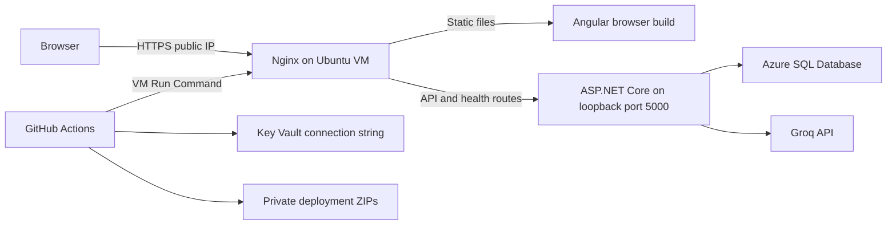
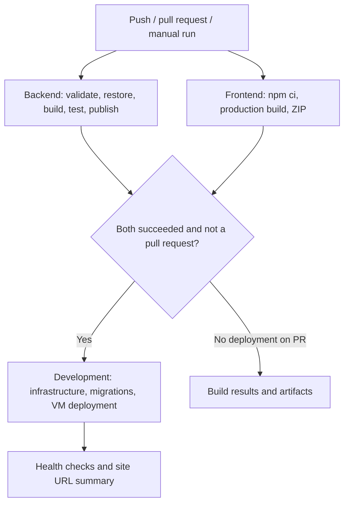
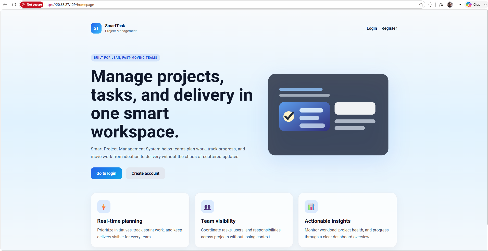
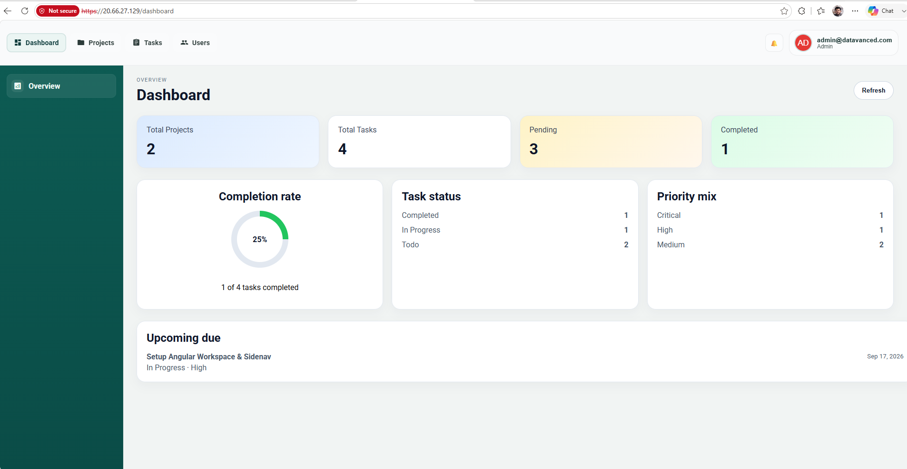
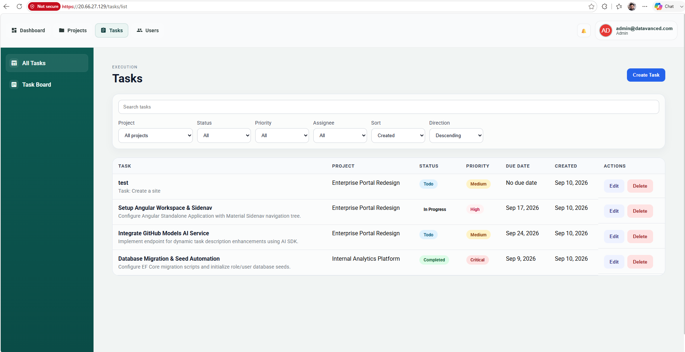
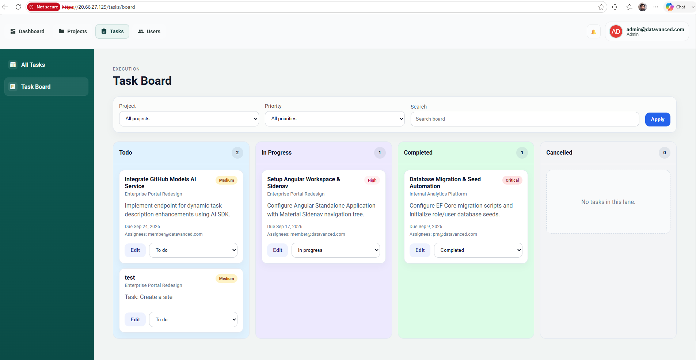
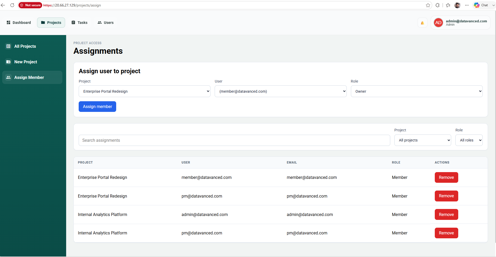
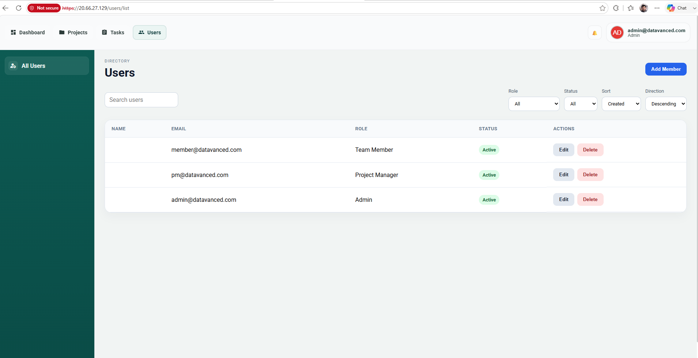
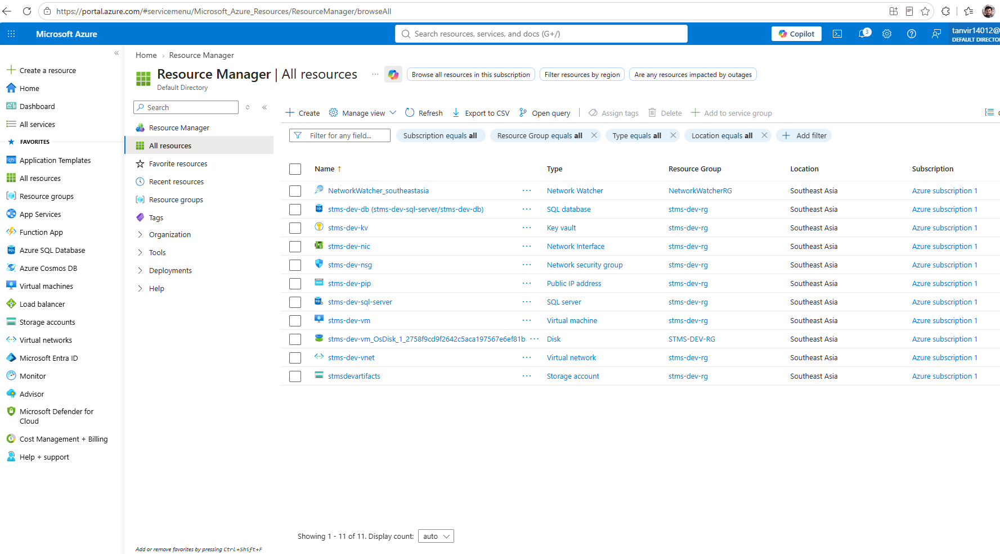

# Smart Task Management System

A full-stack project and task management application built with ASP.NET Core 10 and Angular 21. It includes role-based access control, project membership, task assignments and boards, dashboard summaries, and AI-assisted task description refinement through Groq.

The application has been successfully deployed to Azure. This repository includes Bicep infrastructure, parallel backend/frontend builds, automated deployment to an Ubuntu VM with Nginx, and a separate development cleanup workflow.

## Contents

- [Application and architecture](#application-and-architecture)
- [Run locally](#run-locally)
- [API routes](#api-routes)
- [Azure infrastructure](#azure-infrastructure)
- [GitHub Actions pipeline](#github-actions-pipeline)
- [Configuration on the VM](#configuration-on-the-vm)
- [Cleanup and operations](#cleanup-and-operations)
- [Azure deployment screenshots](#azure-deployment-screenshots)
- [Further documentation](#further-documentation)

## Application and architecture

### Features and stack

- **Projects and tasks:** project membership, task assignment, priorities, status changes, filtering, and a task board.
- **Identity:** ASP.NET Core Identity, JWT access tokens, refresh-token cookies, and role-based authorization.
- **Dashboard:** project/task counts, completion status, priority distribution, and upcoming work.
- **AI:** `GroqModelsAiService` calls Groq's OpenAI-compatible API to refine descriptions.
- **Backend:** .NET 10, ASP.NET Core Minimal API endpoints, EF Core with SQL Server, MediatR, FluentValidation, and AutoMapper.
- **Frontend:** Angular 21, Angular Material/CDK, Tailwind CSS, SCSS, RxJS, reactive forms, and ngx-translate; CI uses Node.js 22.
- **Infrastructure services:** configurable memory/Redis caching, HTTP response caching, EF cache invalidation, rate limiting, request tracing, audit logging, Serilog console/daily-file logging, and OpenTelemetry console exporters.

### Responsibilities after the class-library refactor

The API is the HTTP host and composition root. Business features, service contracts, and infrastructure implementations now live in their respective class libraries rather than under `Api/Services`, `Api/Options`, or `Api/Validators`.

| Project | Current responsibilities |
| --- | --- |
| [Api](Api) | `Program.cs`, HTTP endpoint definitions, configuration, and launch profiles. Endpoints dispatch requests to application handlers. |
| [Application](Application) | Feature commands/queries, handlers, responses, validators, mappings, `ValidationPipelineBehavior`, and interfaces such as `IAppDbContext`, `IAuthService`, `ICurrentUser`, `IAiService`, and `ICacheService`. |
| [Infrastructure](Infrastructure) | `AuthService`, `CurrentUser`, `GroqModelsAiService`, API bootstrap/middleware/options, service scanning, EF Core persistence/migrations/seeding, and caching implementations. |
| [Domain](Domain) | Entities, Identity user/role types, enums, and auditing/soft-delete/multitenancy interfaces. |
| [Shared](Shared) | Shared constants and project-level dependencies. |
| [Infrastructure.Tests](Infrastructure.Tests) | Backend tests executed by the CI workflow. |
| [Frontend/Angular](Frontend/Angular) | Angular application, frontend environments, assets, and npm scripts. |

Project references flow from `Api` to `Application`, `Infrastructure`, and `Shared`; `Infrastructure` references `Application` and `Shared`; `Application` references `Domain` and `Shared`.

```text
Api/
  Endpoints/                        # Auth, users, projects, tasks, AI, menus, dashboard
  Program.cs
Application/
  Features/                         # Handlers, requests, responses, validators
  Interfaces/
  Validators/
  ValidationPipelineBehavior.cs
Infrastructure/
  Services/                         # Authentication, current user, Groq
  Bootstrap/                        # Middleware, options, observability, endpoint wiring
  AssemblyScan/
  Caching/
  Data/EfCore/
    Persistence/                    # DbContext, design-time factory, mappings
      Migrations/
      Seeding/
Domain/
Shared/
Infrastructure.Tests/
Frontend/Angular/
Azure/infra/                        # Bicep templates and development parameters
.github/workflows/                  # CI/CD and development cleanup
docs/images/azure/                  # Deployment screenshots
```

## Run locally

### Prerequisites

- .NET 10 SDK and a reachable SQL Server instance.
- Node.js 22 and npm; use the committed frontend lockfile with `npm ci`.
- EF Core CLI for explicit migrations; CI currently installs `dotnet-ef` version `10.0.11`.
- Trusted local HTTPS certificates for the API and, when using the HTTPS frontend script, Angular.

### Backend

Run these Bash commands from the repository root, replacing the connection-string placeholder. Keep credentials outside committed JSON files.

```bash
export ConnectionStrings__DefaultConnection='YOUR_SQL_SERVER_CONNECTION_STRING'
export Jwt__Key="$(openssl rand -base64 32)"
export Jwt__Issuer='https://localhost:7108'
export Jwt__Audience='https://localhost:4200'
export Cors__AllowedOrigins__0='https://localhost:4200'
export Cors__AllowedOrigins__1='http://localhost:4200'

dotnet restore
dotnet build
dotnet tool install --global dotnet-ef --version 10.0.11
dotnet ef database update --project Infrastructure --startup-project Api
dotnet dev-certs https --trust
dotnet run --project Api/Api.csproj --launch-profile https
```

Install the EF tool once; update an existing installation if necessary. Export the connection string in the shell running migrations: the [design-time factory](Infrastructure/Data/EfCore/Persistence/AppDbContextFactory.cs) reads `ConnectionStrings__DefaultConnection` and otherwise falls back to a developer-specific SQL Server connection.

The explicit `https` launch profile exposes `https://localhost:7108` and `http://localhost:5049` with the `Development` environment. The API registers `/health`; OpenAPI/Swagger middleware is enabled only in Development. See [launchSettings.json](Api/Properties/launchSettings.json) and [bootstrap configuration](Infrastructure/Bootstrap/BootstrapExtensions.cs).

The startup hosted service also checks/applies migrations and seeds roles, users, projects, and tasks. Review [seeding](Infrastructure/Data/EfCore/Persistence/Seeding/SeedingExtensions.cs) before exposing an instance; these are demonstration accounts/data, not a production account-provisioning process.

### Frontend

```bash
cd Frontend/Angular
npm ci
npm start
```

The development frontend runs at `http://localhost:4200`. Its [development environment](Frontend/Angular/src/environments/environment.ts) uses `apiBaseUrl: 'https://localhost:7108/api'`. For HTTPS development, provision the certificate files expected by `npm run start:https`; `npm run cert:setup` invokes the repository's Windows PowerShell certificate helper. HTTPS is recommended for testing secure refresh-token cookies.

```bash
npm run start:https
# Production build:
npm run build:prod
```

The [production environment](Frontend/Angular/src/environments/environment.prod.ts) uses the relative path `/api`, served through Nginx in Azure. The browser output is `Frontend/Angular/dist/smart-task-management-system/browser`.

### Configuration and tests

Signing settings are `Jwt:Issuer`, `Jwt:Audience`, and `Jwt:Key`. Token lifetime/cookie settings are under `Authentication`: `AccessTokenExpirationMinutes`, `RefreshTokenExpirationDays`, and `RefreshTokenCookieName`. HS256 signing requires at least 32 bytes of key material; use a random secret rather than a short password.

AI settings are under `Ai`: `Enabled`, `GroqApiKey`, `GroqEndpoint`, and `Model`. Set `Ai__GroqApiKey` externally or disable AI with `Ai__Enabled=false` for local work. The Azure deployment workflow requires `GROQ_API_KEY` even when AI is disabled in JSON.

```bash
# From the repository root
dotnet test Infrastructure.Tests/Infrastructure.Tests.csproj
```

## API routes

Routes below reflect [Api/Endpoints](Api/Endpoints). Authorization requirements vary by endpoint; protected operations require the appropriate user/role.

| Methods | Route | Purpose |
| --- | --- | --- |
| POST | `/api/auth/register`, `/api/auth/login`, `/api/auth/refresh`, `/api/auth/logout` | Authentication and token lifecycle |
| GET, POST | `/api/projects` | List/create projects |
| GET, PUT, DELETE | `/api/projects/{id}` | Read/update/delete a project |
| GET | `/api/projects/assignments` | List project assignments |
| GET, POST | `/api/projects/{id}/members` | List/assign project members |
| DELETE | `/api/projects/{id}/members/{userId}` | Remove project member |
| GET, POST | `/api/tasks` | List/create tasks |
| GET, PUT, DELETE | `/api/tasks/{id}` | Read/update/delete a task |
| GET | `/api/tasks/board` | Task board |
| POST | `/api/tasks/{id}/assign` | Assign task user |
| DELETE | `/api/tasks/{id}/assign/{userId}` | Unassign task user |
| POST | `/api/ai/improve-description` | AI description refinement |
| GET, POST | `/api/users` | List/create users |
| GET, PUT, DELETE | `/api/users/{id}` | Read/update/delete a user |
| GET | `/api/menus`, `/api/dashboard/summary` | Menus and dashboard |
| GET | `/health` | Anonymous API health endpoint |

## Azure infrastructure

Development is configured for **Southeast Asia (`southeastasia`)**. Names and locations are defined in the workflow and [parameter files](Azure/infra/parameters); keep them consistent when adapting the deployment.

| Template | Resources and configuration |
| --- | --- |
| [rg.bicep](Azure/infra/rg.bicep) | Subscription-scope creation of `stms-dev-rg`. The workflow names its deployment `stms-dev-rg-southeastasia`. |
| [sql.bicep](Azure/infra/sql.bicep) | Logical server `stms-dev-sql-server`, database `stms-dev-db`, and `AllowAzureServices` firewall rule. General Purpose Gen5 serverless (`GP_S_Gen5`, capacity 2), `useFreeLimit: true`, exhaustion behavior `AutoPause`, 60-minute idle auto-pause, and local backup redundancy. Minimum capacity and maximum size are left to Azure defaults. |
| [keyvault.bicep](Azure/infra/keyvault.bicep) | Standard vault `stms-dev-kv`, RBAC authorization, seven-day soft-delete retention, and a Key Vault Secrets Officer assignment for the deployment principal. |
| [storage.bicep](Azure/infra/storage.bicep) | Standard LRS account `stmsdevartifacts`, private `deployments` container, HTTPS-only access, and minimum TLS 1.2. |
| [vm.bicep](Azure/infra/vm.bicep) | Ubuntu 24.04 VM `stms-dev-vm` (currently `Standard_D2s_v3`), managed OS disk, VNet/subnet, NIC, NSG allowing inbound TCP 80/443, and Standard static public IP. A Custom Script extension installs Nginx/.NET 10 runtime and creates `stms-api.service`. |

The VM hosts both applications. Nginx redirects HTTP to HTTPS, serves Angular, preserves `/api/` when proxying to `http://127.0.0.1:5000`, and proxies `/health` to the API. Angular routes fall back to `index.html`.



The SQL free-offer flags do not make the VM, disk, public IP, or blob storage free. Region/subscription eligibility still needs verification. This is an IP-based development deployment with a self-signed certificate, not a zero-downtime or fully hardened production hosting design.

## GitHub Actions pipeline

Source of truth: [dev-cicd.yml](.github/workflows/dev-cicd.yml). All runner commands use Bash on `ubuntu-latest`; the generated VM script uses `/bin/sh`.

### Triggers and jobs

| Event | Behavior |
| --- | --- |
| Push to `dev` or `feature/dev/**` | Build/test backend and build frontend, then deploy if both succeed. |
| Pull request targeting `dev` | Run both build jobs; skip Azure deployment. |
| Manual `workflow_dispatch` | Run both builds and deploy the selected ref, subject to environment rules. |
| Push to `master` or pull request targeting `master` | Not matched by the current automatic triggers. |



1. **Backend job (25-minute timeout):** checks `Api/appsettings.json` using `jq empty`; installs .NET 10; caches NuGet packages keyed by project/package configuration; restores, builds Release, and runs `Infrastructure.Tests`. Publish uses `--no-build --no-restore` to reuse the build. `publish.zip` is uploaded as artifact `backend`.
2. **Frontend job (20-minute timeout):** runs in parallel with backend; sets up Node 22 with an npm cache keyed by `package-lock.json`; runs `npm ci --no-audit --no-fund` and `npm run build:prod`; checks `index.html` and uploads `frontend-build.zip` as artifact `frontend`. The workflow builds Angular but does not run frontend tests or lint.
3. **Artifact retention:** both GitHub artifacts are retained for seven days; additional artifact compression is disabled because the files are already ZIPs. Azure blob retention is separate: the storage template does not define an artifact lifecycle policy.
4. **Deployment gate (60-minute timeout):** waits for both jobs, skips pull requests, and uses the GitHub `Development` environment. Its `stms-dev-azure-resources` concurrency group is shared with cleanup, with `cancel-in-progress: false`. Repository contents permission is read-only; OIDC token permission is granted to the deployment job. Checkout does not persist Git credentials.
5. **Preflight and Azure login:** validates JSON, required secrets, and a minimum 32-byte JWT key. `azure/login` authenticates using OIDC. Both build artifacts are downloaded.
6. **Infrastructure:** sequentially deploys resource group, SQL, Key Vault, storage, and VM Bicep. It looks up the service principal object ID and Secrets Officer role ID for the vault assignment. Infrastructure is reconciled on every deployment, including after cleanup; this workflow does not implement changed-path or configuration-only deployment.
7. **Connection string and SQL access:** writes `SqlConnectionString` to Key Vault, retrying for RBAC propagation, then reads/masks it. It resolves the VM public IP and creates `AllowVM`. The Bicep SQL server also enables `AllowAzureServices`; the two IP rules are not the only allowed access.
8. **Migrations:** installs .NET/EF tooling on the deployment runner, restores dependencies with the NuGet cache, creates a uniquely named temporary runner firewall rule, and runs `dotnet ef database update --project Infrastructure --startup-project Api`. Cleanup attempts to delete that rule even after migration failure. The API also checks migrations/seeding at startup.
9. **Configuration and package transport:** converts base JSON settings into a root-protected environment file with deployment overrides (details below). Uploads API/frontend ZIPs to the private blob container using a storage account key and generates HTTPS, read-only SAS URLs expiring after 30 minutes. Blob names contain the run ID and attempt.
10. **One VM Run Command:** installs missing tools only, downloads/unzips both packages before stopping the API, checks `Api.dll` and `index.html`, and configures Nginx/TLS. It replaces deployed files, installs the environment file, restarts `stms-api`, and reloads or starts Nginx. This includes a brief API interruption and does not retain a rollback release.
11. **Verification:** checks loopback API health and local HTTPS using the actual certificate, then requires the `STMS_DEPLOY_OK` marker in Run Command output. Public checks request `/` and `/health` using `curl -k` for the self-signed certificate. Success publishes a clickable current IP URL in the run summary. Runner temporary configuration/script/result files are removed.

### GitHub environment setup

Create an environment named **`Development`** with these secrets:

| Secret | Used for |
| --- | --- |
| `AZURE_CLIENT_ID` | Deployment service principal/application ID |
| `AZURE_TENANT_ID` | Microsoft Entra tenant |
| `AZURE_SUBSCRIPTION_ID` | Target subscription |
| `SQL_ADMIN_PASSWORD` | SQL provisioning and application connection string |
| `VM_ADMIN_PASSWORD` | VM administrator provisioning |
| `JWT_KEY` | JWT signing secret; at least 32 bytes |
| `GROQ_API_KEY` | Groq API authentication |

Configure a federated identity credential for this repository's `Development` environment (subject `repo:tanvir14012/DatavancedBD.AspNetCore.SmartTaskManagementSystem:environment:Development`). For a fork, use its owner/repository. Configure environment deployment-branch rules and approvals as appropriate; YAML referencing an environment does not itself create an approval policy.

The Azure principal needs access to subscription/resource-group deployments, resource creation, role assignment creation, its service-principal lookup, Key Vault secret operations, storage account key retrieval, SQL firewall changes, and VM Run Command. Cleanup additionally needs group deletion and deleted-vault read/purge permissions. A resource-scoped Secrets Officer assignment alone is not sufficient for all these operations. Resource names must be available in the target subscription/region and globally unique where Azure requires it.

## Configuration on the VM

The generator reads **`Api/appsettings.json` only**, not `appsettings.Development.json`. Because it uses `jq`, the base file must contain strict JSON without comments or trailing commas.

| Source / setting | Deployed behavior |
| --- | --- |
| Base JSON scalar values | Nested keys use `__`; array elements use numeric indexes. |
| `ConnectionStrings:DefaultConnection` | Replaced by the Azure SQL connection string read from Key Vault. |
| `Cors:AllowedOrigins` | First two entries overridden with HTTPS/HTTP VM IP origins. |
| `Jwt:Issuer`, `Jwt:Audience` | Set to the HTTPS VM IP URL. |
| `Jwt:Key`, `Ai:GroqApiKey` | Supplied from GitHub environment secrets. |
| `ASPNETCORE_ENVIRONMENT` | `Production`, despite the GitHub environment being named `Development`. |
| `ASPNETCORE_URLS` | `http://127.0.0.1:5000`. |
| Dotted `Microsoft.AspNetCore` logging key, nulls, empty arrays | Omitted from the environment file; retained in the published JSON configuration. |

The API still loads its normal JSON configuration, with environment values overriding matching keys. Arrays merge by index; adding more base CORS entries requires revisiting the generator. If an `appsettings.Production.json` is added later, it participates in normal Production configuration loading as well.

| VM path | Purpose |
| --- | --- |
| `/var/www/stms-api` | Published API, owned by `www-data` |
| `/var/www/stms-web` | Angular browser files |
| `/etc/stms-api.env` | Environment settings, installed as `root:root`, mode `600` |
| `/etc/systemd/system/stms-api.service` | Service created by Bicep; runs as `www-data` and references the environment file |
| `/etc/nginx/sites-available/stms` | Nginx site, linked from `sites-enabled` |
| `/etc/nginx/ssl/stms.crt` and `stms.key` | Public certificate (mode `644`) and private key (mode `600`) |

The certificate includes the public IP as an IP SAN, lasts 365 days, and is regenerated during deployment when missing, within 30 days of expiry, or not matching the IP. It is not automatically trusted by browsers, and renewal requires a deployment run. Base64 in Run Command is used for transport/quoting, not encryption; do not publish generated environment files, SAS URLs, or keys.

## Cleanup and operations

[dev-cleanup.yml](.github/workflows/dev-cleanup.yml) is manually dispatched and requires the exact confirmation **`DELETE`**. It shares the deployment concurrency group, lists the group's resources, requests deletion, waits up to one hour, and verifies the group is gone. It then locates the matching soft-deleted Key Vault by original resource ID, purges it if permitted, and verifies completion. Purge protection or missing permissions cause failure; diagnostics are printed. The job timeout is 90 minutes.

This is destructive teardown, not application rollback. It deletes the application database and files with the group and permanently purges vault secrets. It does not delete unrelated resource groups, subscription deployment history, or the deployment identity. In particular, the screenshot shows `NetworkWatcher_southeastasia` in **`NetworkWatcherRG`**, outside `stms-dev-rg`; the cleanup workflow does not target that resource.

On the VM:

```bash
sudo systemctl status stms-api --no-pager
sudo journalctl -u stms-api -n 100 --no-pager
sudo nginx -t
curl -fsS http://127.0.0.1:5000/health
sudo tail -n 100 /var/www/stms-api/Logs/log-YYYYMMDD.txt
```

Logs inside the API deployment directory are replaced along with its files on deployment; use journal output or external log retention when historical logs are needed. Health checks confirm basic availability, not every authenticated feature. Common configuration failures include invalid JSON, a short JWT secret, SQL free-offer constraints, unavailable regional SKUs, and insufficient Azure permissions.

## Azure deployment screenshots

These screenshots supplied from successful deployments show the running application and provisioned resources. They are historical evidence, not a live availability guarantee or an Actions-run log. The application captures show an earlier public IP; use the latest workflow summary for the current URL. The browser warning reflects the self-signed development certificate.

### Application home



### Dashboard



<details>
<summary>More application screens: tasks, board, assignments, and users</summary>

#### Task list



#### Task board



#### Project assignments



#### Users



</details>

### Azure resources



## Further documentation

- [Azure CI/CD workflow](.github/workflows/dev-cicd.yml) and [development cleanup](.github/workflows/dev-cleanup.yml)
- [Bicep infrastructure](Azure/infra)
- [Manual Nginx deployment guide](DeploymentToNginx.md): domain/local-server walkthrough; the Azure workflow instead uses Azure SQL and an IP SAN certificate.
- [IIS deployment guide](DeploymentToIIS.md)
- [AI setup](AI_SETUP.md) and [prompt strategy](PROMPTS.md)
- [API Postman collection](Api/SmartTaskManagementSystem.postman_collection.json)

The current source and workflows take precedence over older manual examples when paths or settings differ.
