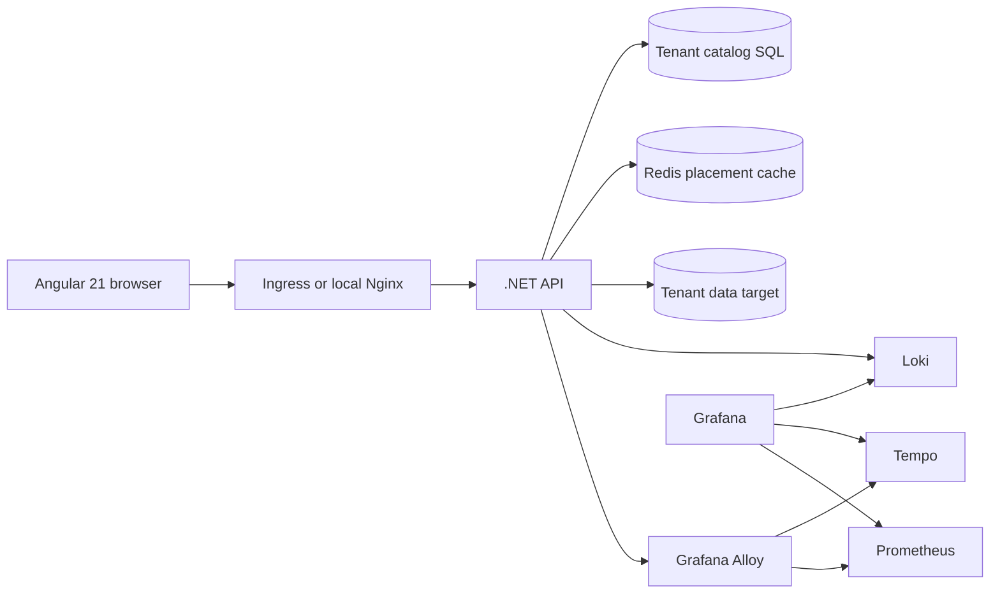
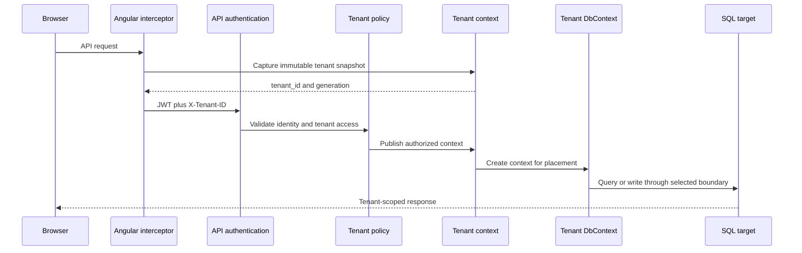
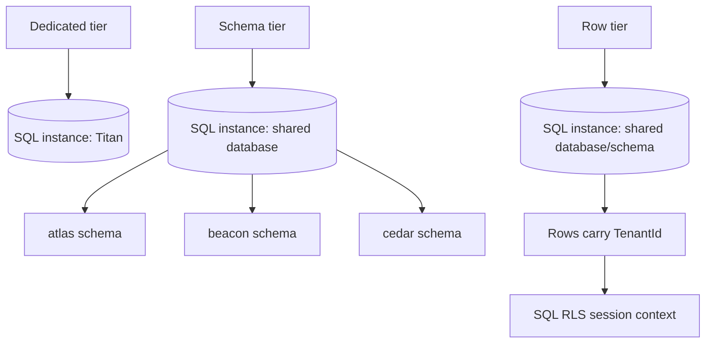
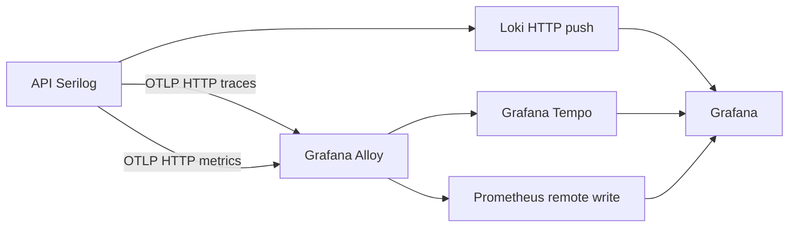

# Smart Task Management System developer wiki

This guide describes the code that is in the repository today. It is the quickest route from a
fresh checkout to a working local environment and a safe change to tenancy, persistence, frontend,
or telemetry.

## Repository map

| Area | Responsibility |
| --- | --- |
| `Api` | HTTP composition, authentication, health probes, endpoint mapping, local tenant binding |
| `Application` | MediatR commands/queries, validators, interfaces, tenant contracts |
| `Domain` | Entities, value objects, enums, and persistence-independent rules |
| `Infrastructure` | EF Core, Identity, caching, SQL tenancy strategies, migrations, provisioning, logging, OTLP |
| `Admin` | Explicit migrations and local database initialization; never runs in API startup |
| `Worker` | Optional bounded tenant job execution |
| `Frontend/Angular` | Angular 21 UI, authentication, tenant context, API interceptors |
| `deploy/local` | Nine-company Docker acceptance composition and verification |
| `deploy/observability` | Loki, Alloy, Tempo, Prometheus, and Grafana configuration |
| `deploy/aks` | Helm chart and AKS release operations |
| `Azure/infra` | Azure resource definitions and identity wiring |
| `Infrastructure.Tests` | Tenant model, routing, authorization, migration, and isolation tests |

## Runtime architecture

The production shape separates browser delivery, API policy, the tenant catalog, and tenant data.
The local shape uses the same API and Angular images but supplies a fixed tenant binding per API
container so that all nine companies can run on one workstation.



## Request and tenant flow



The browser context is a selector and request-generation fence. It is never an authorization
credential. The API authenticates the caller, validates the tenant claim and membership, resolves
the authoritative placement, and only then creates tenant persistence. Local APIs use the immutable
`LocalTenantBinding` supplied by container environment variables; a request header cannot move a
local API to another company.

## Isolation models

`TenantId` identifies a purchasing organization. Teams and departments remain business entities
inside that organization.

| Local companies | SQL topology | EF and database boundary | Intended use |
| --- | --- | --- | --- |
| Titan Technologies | Dedicated SQL Server container and `StmsLocaldedicated` database | Database boundary plus tenant-aware model | Large company with strong physical separation |
| Atlas, Beacon, Cedar | One SQL Server container and `StmsLocalschema` database | `atlas`, `beacon`, and `cedar` schemas | Medium companies sharing infrastructure |
| Delta, Ember, Fern, Grove, Harbor | One SQL Server container, `StmsLocalrow`, `dbo` schema | Composite tenant keys, EF query filters, write guards, and SQL RLS | Small companies sharing tables |



The tenant model is applied by `TenantModelConfiguration`. It prefixes primary keys, foreign keys,
and indexes with `TenantId`, adds a tenant query filter, preserves generated integer IDs, and rejects
cross-tenant writes in `AppDbContext`. `TenantSqlSessionInterceptor` sets an immutable SQL session
tenant and fails closed when the RLS policy is absent or incomplete. The Admin path creates the RLS
function and policy; the API never performs DDL.

## Local Docker environment

Start the environment from the repository root:

```powershell
./deploy/local/Start-LocalSaas.ps1
```

The script generates `deploy/local/generated/compose.json`, creates three SQL Server services,
initializes empty local databases through `Admin.dll local-init`, builds the API and Angular images,
and starts the telemetry stack. There are 26 long-running services:

```text
3 SQL Server + 9 API + 9 Angular + Loki + Grafana + Alloy + Tempo + Prometheus = 26
```

The nine initializer containers exit successfully after provisioning. Generated secrets, Nginx
configuration, tenant runtime files, and verification output are ignored by Git. The complete
company and port map is in [deploy/local/README.md](../deploy/local/README.md).

Each local frontend receives a generated `tenant-config.js`. It contains only the UUID and display
name, initializes `TenantContextStore`, and does not contain a connection string or credential.
Each API receives a fixed `LocalTenant__Id`, isolation, schema, and target. The API derives its SQL
connection from the container environment and uses tenant-aware Identity stores.

Run acceptance checks after startup:

```powershell
./deploy/local/Test-LocalSaas.ps1
```

The test uses native `curl.exe` for PowerShell compatibility. It checks every frontend and API,
registers or logs in one admin per company, reads menus and projects, creates a project/task when
needed, checks refresh cookies, rejects cross-company tokens, validates SQL layout/RLS, and confirms
26 running services. A successful report is written to `deploy/local/generated/verification.json`.

## Configuration ownership

Configuration has one owner per concern:

| Concern | Local source | Production source |
| --- | --- | --- |
| Company identity and local placement | Generated Compose environment | Tenant catalog and reviewed provisioning |
| Tenant data connection | Local Compose environment | Key Vault-backed target configuration |
| Catalog SQL and Redis | Not used by `LocalDocker` API composition | External SQL and Redis services |
| JWT issuer, audience, key | Generated local secret/config | Key Vault |
| Logs | `Observability__Loki__Endpoint` | Deployment-provided endpoint |
| Traces | `Observability__Otlp__TracesEndpoint` | Collector or Alloy endpoint |
| Metrics | `Observability__Otlp__MetricsEndpoint` | Collector or Alloy endpoint |
| Non-secret policy | Compose or Helm values | Helm ConfigMap |

The sample contract is in `Api/appsettings.json`. Environment variables use .NET hierarchy, for
example:

```text
ConnectionStrings__DefaultConnection
LocalTenant__Id
LocalTenant__Isolation
LocalTenant__Schema
LocalTenant__Target
Observability__Loki__Endpoint
Observability__Loki__Tenant
Observability__Otlp__TracesEndpoint
Observability__Otlp__MetricsEndpoint
```

Never put tenant credentials, JWT keys, or connection strings in source, images, Angular assets,
Compose committed files, or Helm values.

## Observability



Serilog writes stdout and rolling files, then pushes best-effort structured logs to Loki when an
endpoint is configured. Labels remain bounded to application, environment, deployment tenant, and
level. OpenTelemetry emits traces and runtime/ASP.NET metrics to the console for diagnostics and to
OTLP endpoints when configured. Alloy forwards traces to Tempo and converts metrics to Prometheus
remote write. Export failures do not prevent API startup.

Open Grafana at `http://localhost:3000` with `admin`/`admin`. Use Explore with Loki for logs,
Tempo for traces, and Prometheus for metrics. Health endpoints are:

```text
Loki       http://localhost:3100/ready
Tempo      http://localhost:3200/ready
Prometheus http://localhost:9090/-/ready
Alloy      http://localhost:12345/-/ready
```

## Adding a company locally

1. Add one record to `deploy/local/companies.json` with a unique slug, UUID, display name, tier,
   schema, frontend port, and API port.
2. Use `dedicated` for a new SQL Server/database, `schema` for another schema in the shared schema
   database, or `row` for another TenantId in the shared row database.
3. Regenerate and start the environment with `Start-LocalSaas.ps1`.
4. Keep the generated credentials file so existing volumes and admin accounts remain usable.
5. Run `Test-LocalSaas.ps1` and confirm the new company appears in `verification.json`.

For production, do not edit the local inventory. Create the placement through the Admin provisioning
workflow, persist it in the catalog with compare-and-set, migrate the target, validate it, and only
then activate the placement.

## Changing the data model safely

1. Change the Domain entity and its EF configuration.
2. Review tenant key, foreign key, index, query-filter, and RLS effects in
   `TenantModelConfiguration` and `TenantRowSecurityScript`.
3. Update the reviewed Admin migration path. API startup must remain free of migrations and DDL.
4. Add focused model or isolation tests in `Infrastructure.Tests/Tenancy`.
5. Run the full backend tests, Angular tests, and local acceptance environment.
6. Use expand-and-contract for deployed databases: add compatible structures, deploy readers/writers,
   backfill, then remove old structures after rollback is no longer needed.

## Testing and release gates

Backend:

```powershell
dotnet build DatavancedBD.AspNetCore.SmartTaskManagementSystem.slnx --no-restore -v:minimal
dotnet test Infrastructure.Tests/Infrastructure.Tests.csproj --no-build -v:minimal
```

Frontend:

```powershell
cd Frontend/Angular
npm test -- --watch=false
npm run build:prod
cd ../..
```

Then run `git diff --check` and the local Docker acceptance script. Unit tests validate contracts and
model composition; the local environment validates SQL Server, RLS, container networking, telemetry
backends, browser delivery, and simultaneous service startup.

## Troubleshooting

| Symptom | Check |
| --- | --- |
| Docker engine pipe missing | Start Docker Desktop, select Linux containers, and verify `docker info` |
| Initializer exits non-zero | `docker compose -f deploy/local/generated/compose.json logs init-<slug>` |
| API is unhealthy | `docker compose ... logs api-<slug>` and inspect its SQL connection/environment |
| Browser says tenant context is missing | Rebuild the Angular image so `tenant-config.js` is mounted, then hard reload |
| Grafana has no data | Check Alloy, Loki, Tempo, and Prometheus health endpoints and API container logs |
| Existing data behaves unexpectedly | Preserve `generated/secrets.json` and volumes; changing the password file does not change existing SQL data |

## Production boundaries

The local harness is a deterministic acceptance environment, not a replacement for AKS. Production
requires external SQL/Redis, Key Vault-backed secrets, workload identity, catalog authority and
membership data, reviewed migrations, DNS/certificates, network policy, backup/restore, and live
authorization/isolation acceptance. Follow [deploy/aks/README.md](../deploy/aks/README.md) for the
release path.
