# Multitenancy in the Smart Task Management System

This guide explains how the `saas` branch extends the application to serve multiple organizations. It follows the actual code from tenant selection to database access, then covers caches, administration, background work, containers, configuration, and the remaining work needed for a shared production service.

The intended reader knows basic ASP.NET Core dependency injection, authentication, and Entity Framework Core. Each implementation excerpt identifies its source and explains the reason for the change. Short excerpts are copied from the source; examples marked **illustrative** explain a design or show future integration and are not additional code already registered in the application.

## Contents

1. [What changed from master](#1-what-changed-from-master)
2. [Tenant identity and the three isolation models](#2-tenant-identity-and-the-three-isolation-models)
3. [Two runtime paths in this branch](#3-two-runtime-paths-in-this-branch)
4. [Placement, access, and scoped context](#4-placement-access-and-scoped-context)
5. [Resolving and authorizing a request](#5-resolving-and-authorizing-a-request)
6. [Catalog storage and placement caching](#6-catalog-storage-and-placement-caching)
7. [Selecting the database and schema](#7-selecting-the-database-and-schema)
8. [The tenant-aware EF Core model](#8-the-tenant-aware-ef-core-model)
9. [SQL row-level security](#9-sql-row-level-security)
10. [Identity, tokens, and application handlers](#10-identity-tokens-and-application-handlers)
11. [Application and HTTP cache isolation](#11-application-and-http-cache-isolation)
12. [Schema creation, migrations, and provisioning](#12-schema-creation-migrations-and-provisioning)
13. [Background jobs and resource limits](#13-background-jobs-and-resource-limits)
14. [Configuration ownership and dependency injection](#14-configuration-ownership-and-dependency-injection)
15. [Docker and the local company topology](#15-docker-and-the-local-company-topology)
16. [Running Angular or React locally](#16-running-angular-or-react-locally)
17. [Observability and health checks](#17-observability-and-health-checks)
18. [Tests and what they prove](#18-tests-and-what-they-prove)
19. [Production deployment and future scale](#19-production-deployment-and-future-scale)
20. [A practical learning and extension sequence](#20-a-practical-learning-and-extension-sequence)

## 1. What changed from master

The comparison reference for this guide is local `master` at `f1b4739` and committed `saas` at `413b63c`, together with the working-tree frontend-selection and disposable-local-start changes described below. The React source already exists on this version of `master`; bringing it into `saas` is not itself a new tenancy mechanism. Its local Docker packaging and selectable startup are the relevant additions.

The original application already had Identity, JWT authentication, projects, tasks, roles, a database context, and caching. An application user or project member is not automatically an organization tenant. The new tenancy layer establishes an organization boundary around those existing features.

| Area | Existing master behavior | SaaS addition or change | Source to inspect |
| --- | --- | --- | --- |
| Organization identity | No equivalent placement/context layer | Validated tenant placement, identity, lifecycle, and scoped context | [Application/Tenancy](../Application/Tenancy) |
| Request selection | Authentication and ordinary endpoint authorization | Host directory, selector validation, membership checks, `SaasTenant` policy | [Api/Tenancy](../Api/Tenancy) |
| Storage selection | Legacy context uses one configured connection and service schema | Logical targets and Database/Schema/Row strategies | [Persistence](../Infrastructure/Tenancy/Persistence) |
| EF mapping | Original entity and Identity keys | Tenant property, composite keys, tenant-prefixed foreign keys/indexes, filters | [TenantModelConfiguration.cs](../Infrastructure/Tenancy/Persistence/TenantModelConfiguration.cs) |
| Writes | Original save/audit behavior | Tenant ownership validation on all SaveChanges entry points | [AppDbContext.cs](../Infrastructure/Data/EfCore/Persistence/AppDbContext.cs) |
| Identity | Standard EF Identity stores | Composite-key-aware user/role stores and tenant token claim | [TenantIdentityStores.cs](../Infrastructure/Tenancy/Persistence/TenantIdentityStores.cs) |
| Caching | User/entity/query keys | Organization namespaces and matching invalidation | [TenantCacheKeyBuilder.cs](../Infrastructure/Caching/Keys/TenantCacheKeyBuilder.cs) |
| Administration | Legacy migration/seeding machinery | Separate Admin executable, migration runner, placement provisioning | [Admin](../Admin), [Migrations](../Infrastructure/Tenancy/Migrations), [Provisioning](../Infrastructure/Tenancy/Provisioning) |
| Background processing | No corresponding tenant worker executable | Tenant work envelope, reauthorization, bounded admission | [Worker](../Worker), [Resilience](../Infrastructure/Tenancy/Resilience) |
| Local deployment | Individual app/deployment setup | Nine-company SQL/API/frontend composition | [Start-LocalSaas.ps1](../deploy/local/Start-LocalSaas.ps1) |
| Infrastructure | Earlier VM deployment paths | API/Admin/Worker images, AKS manifests, telemetry stack | [deploy/aks](../deploy/aks), [Azure/infra/aks.bicep](../Azure/infra/aks.bicep) |

To reproduce a focused review from the repository root:

```powershell
# Compare the two current branch tips.
git diff --name-status master saas
git diff master saas -- Application/Tenancy Infrastructure/Tenancy Api/Tenancy
git diff master saas -- Infrastructure/Data/EfCore Infrastructure/Services/AuthService.cs

# Compare master with the current tracked working tree, including local edits.
git diff master -- deploy/local docker-compose.saas.yml

# Untracked files are not included in git diff.
git status --short --untracked-files=all
```

`git diff master...saas` answers a different question: changes from the branches' merge base to `saas`. Use the two-tip form when asking exactly how the currently checked references differ. No branch checkout is needed for these commands.

## 2. Tenant identity and the three isolation models

A tenant is an organization that owns its users and business records. `TenantId` is its stable identity. A placement tells the service where that tenant's records are stored. Moving an organization to a different database must not require changing its tenant ID.

The application implements a hybrid design: different organizations can use different storage isolation models while sharing application code.

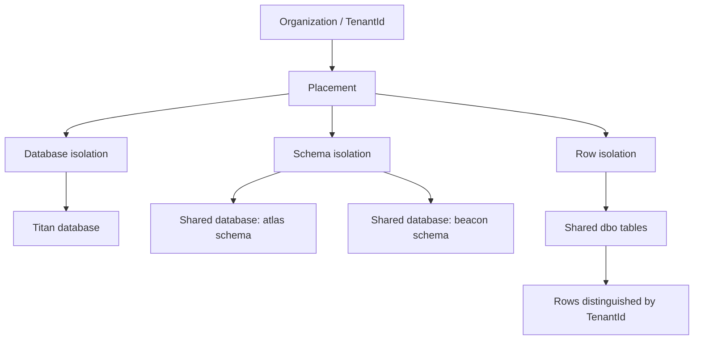

| Model | Boundary | Local example | Principal trade-off |
| --- | --- | --- | --- |
| Database | Separate database for an organization | Titan, with a dedicated local SQL container | Easier per-tenant restore and capacity separation; more databases and pools to operate |
| Schema | Separate schema within a database | Atlas, Beacon, Cedar | Shared database operation with separate table sets; more schema/model/migration variants |
| Row | Shared tables containing tenant-owned rows | Delta, Ember, Fern, Grove, Harbor | Efficient sharing; every query, key, write, cache, and maintenance path needs tenant discipline |

Database isolation does not inherently require one SQL Server instance per tenant. The local example deliberately gives Titan its own SQL container. A production database-per-tenant design can place multiple databases on a server or other managed capacity boundary.

All three tenant storage modes use the tenant-aware EF model in this repository. Database and schema tenants also receive tenant keys and filters; row tenants additionally require the SQL row-security policy.

## 3. Two runtime paths in this branch

Understanding this distinction prevents the most common misreading of the implementation.

### 3.1 The runnable local path

The nine-company environment assigns one fixed organization to each API container. Deployment configuration supplies its tenant ID, isolation model, schema, database connection, and token issuer/audience. `LocalTenantBinding` constructs that placement. The application does not query the production catalog to discover it.

### 3.2 The shared request path

The branch also contains a shared API design that resolves a request authority/header, checks authenticated organization claims and durable membership, reads authoritative placement, and publishes one scoped context. This path is registered outside `LocalDocker`, but registration alone does not attach it to business endpoints or replace legacy `IAppDbContext`/Identity registrations.

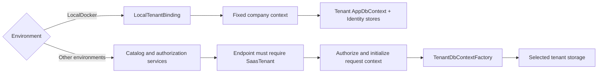

Source: [Api/Program.cs](../Api/Program.cs).

```csharp
if (!builder.Environment.IsEnvironment("LocalDocker"))
{
    builder.Services.AddTenantCatalog(builder.Configuration);
    builder.Services.AddTenantAuthorization(builder.Configuration);
}
builder.Services.AddTenantStorage();
```

The condition separates fixed local placement from catalog-based authorization. `AddTenantStorage` registers explicit factories and strategies. Later, `builder.AddLocalTenant()` supplies the local override only when the environment matches.

Source: [LocalTenantRegistration.cs](../Api/Tenancy/LocalTenantRegistration.cs), the local dependency-injection replacement:

```csharp
builder.Services.AddSingleton(binding);
builder.Services.AddScoped<ITenantContextAccessor>(_ => binding);
builder.Services.AddScoped<ITenantCacheKeyBuilder, Infrastructure.Caching.Keys.TenantCacheKeyBuilder>();
builder.Services.AddScoped<AppDbContext>(_ => binding.CreateContext());
builder.Services.AddScoped<IAppDbContext>(sp => sp.GetRequiredService<AppDbContext>());
builder.Services.AddScoped<IUserStore<AppUser>, TenantUserStore>();
builder.Services.AddScoped<IRoleStore<AppRole>, TenantRoleStore>();
```

These registrations are added after the earlier bootstrap registrations. Ordinary single-service resolution therefore picks the local context and stores. `IAppDbContext` resolves the same scoped `AppDbContext` instance rather than creating a second change tracker. This is the concrete bridge that lets existing application handlers run against the tenant model locally without changing every handler constructor.

| Component | Current integration status |
| --- | --- |
| Fixed local tenant storage and Identity | Connected to the local API composition |
| Shared `SaasTenant` authorization policy | Implemented and registered outside LocalDocker; existing business endpoints do not call `RequireTenantContext()` |
| Shared storage factory | Implemented; does not automatically replace all legacy context consumers |
| Authority and membership SQL readers | Implemented; tables/data and trusted token issuance must be supplied |
| Production migration runner | Implemented orchestration; tenant-model upgrade path still needs completion and live validation |
| Worker | Implemented skeleton; executable requires a real work handler, and the chart disables it by default |

A working nine-company demo therefore proves useful local isolation behavior. It does not prove that every endpoint of a single shared production API has completed the tenant cutover.

## 4. Placement, access, and scoped context

### 4.1 Placement is metadata, not a connection string

Source: [TenantPlacement.cs](../Application/Tenancy/TenantPlacement.cs).

```csharp
public enum TenantIsolation
{
    Database = 0,
    Schema = 1,
    Row = 2
}

public enum TenantLifecycle
{
    Provisioning = 0,
    Active = 1,
    Moving = 2,
    Suspended = 3
}
```

`TenantPlacement` stores `TenantId`, `Isolation`, `TargetId`, optional `Schema`, `Region`, `Version`, and `Lifecycle`. Its constructor rejects empty identities, invalid enum values, nonpositive versions, invalid logical handles, and invalid schema names. A schema override is accepted only for `Schema` isolation.

`TargetId` is a logical handle such as `shared-east`. The application resolves its connection details from trusted configuration. Putting a connection string in a client header, token, or placement record would collapse the boundary between selecting an organization and choosing arbitrary infrastructure.

Constructor validation is structural. It does not establish membership, database existence, schema compatibility, or placement freshness.

### 4.2 Access identity includes the issuer

[TenantAccess.cs](../Application/Tenancy/TenantAccess.cs) associates tenant ID with subject ID and issuer. Subject `42` from issuer A is not assumed to be the same person as subject `42` from issuer B. That distinction is retained in the membership table's key.

[TenantContext.cs](../Application/Tenancy/TenantContext.cs) combines an active placement with that subject and issuer. Only active placements can become contexts, but authorization must still happen before the context is exposed to request code.

### 4.3 A scope can be initialized once

Source: [TenantContextScope.cs](../Application/Tenancy/TenantContextScope.cs).

```csharp
public TenantContext Current => Volatile.Read(ref _current)
    ?? throw new InvalidOperationException("Tenant context has not been established for this scope.");

public void Initialize(TenantContext context)
{
    ArgumentNullException.ThrowIfNull(context);
    if (Interlocked.CompareExchange(ref _current, context, null) is not null)
        throw new InvalidOperationException("Tenant context is already established for this scope.");
}
```

Reading too early fails. Setting a second context fails, even if it contains the same organization. `ITenantContextAccessor` and `ITenantContextInitializer` are registered against the same scoped object, so an authorization handler and a downstream factory see the same immutable snapshot.

A singleton request context would leak tenant state across concurrent requests. A background worker creates a new DI scope for each job instead of borrowing a web request's state. The local binding is a deliberate exception: a container has exactly one server-owned placement for its entire lifetime.

## 5. Resolving and authorizing a request

### 5.1 Resolution only identifies a candidate

Sources: [TenantRequestResolver.cs](../Application/Tenancy/Resolution/TenantRequestResolver.cs), [TenantAuthority.cs](../Application/Tenancy/Resolution/TenantAuthority.cs), [SqlTenantHostDirectory.cs](../Infrastructure/Tenancy/Authorization/SqlTenantHostDirectory.cs).

```csharp
if (_options.SharedApiAuthorities.Contains(authority))
{
    cancellationToken.ThrowIfCancellationRequested();
    return selector ?? throw new TenantResolutionException(TenantResolutionFailure.MissingSelector);
}
```

For configured shared API authorities, the request must carry an explicit tenant selector. For tenant-specific authorities, the resolver queries the directory. If both a host mapping and a selector exist, they must agree. The selector must be a nonempty GUID in the expected 36-character format. Unknown hosts, conflicting selectors, and malformed authorities are rejected.

`SqlTenantHostDirectory` reads active mappings from `catalog.TenantAuthorities`. Host normalization is centralized instead of allowing each endpoint to parse host names differently.

The HTTP handler reads `Request.Host`, not arbitrary forwarded headers. Production proxies must validate forwarding provenance before a forwarded host becomes trusted request state; this resolver does not configure that trust for the deployment.

### 5.2 Authentication, membership, and placement answer different questions

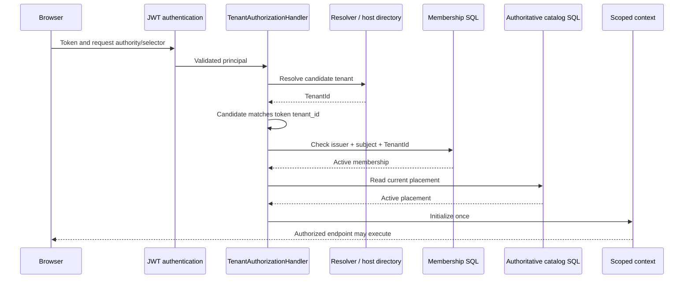

Source: [TenantContextAuthorizer.cs](../Application/Tenancy/Authorization/TenantContextAuthorizer.cs).

```csharp
await _access.ValidateAsync(access, cancellationToken).ConfigureAwait(false);
cancellationToken.ThrowIfCancellationRequested();
var placement = await _catalog.FindAsync(access.TenantId, cancellationToken).ConfigureAwait(false);
cancellationToken.ThrowIfCancellationRequested();
if (placement is null)
    throw new TenantAccessDeniedException();
if (placement.TenantId != access.TenantId)
    throw new InvalidDataException("The authoritative catalog returned a different organization.");
if (placement.Lifecycle != TenantLifecycle.Active)
    throw new TenantAccessDeniedException();
return new TenantContext(placement, access.SubjectId, access.Issuer);
```

Membership is checked before placement is disclosed or catalog lookup work is performed. The authorizer requires `IAuthoritativeTenantCatalog`, not a cache-first placement reader. A cached route is not evidence that membership remains active or that an organization has not been suspended.

[TenantPrincipalAccess.cs](../Application/Tenancy/Authorization/TenantPrincipalAccess.cs) requires one authenticated identity and unambiguous `sub`, `iss`, and `tenant_id` claims. It rejects duplicate security claims and a conflicting legacy `NameIdentifier`. [BootstrapExtensions.cs](../Infrastructure/Bootstrap/BootstrapExtensions.cs) sets `MapInboundClaims = false` to retain the protocol claim names.

[TenantAuthorizationHandler.cs](../Api/Tenancy/TenantAuthorizationHandler.cs) checks that the resolved organization matches the token organization, authorizes access, initializes the scope, and only then succeeds. Expected access/selection failures produce framework challenge/forbid behavior; unexpected provider failures propagate instead of being interpreted as permission to continue. Cancellation is respected throughout.

### 5.3 An endpoint must opt into the tenant boundary

Source: [TenantPipeline.cs](../Api/Tenancy/TenantPipeline.cs).

```csharp
services.AddAuthorization(options => options.AddPolicy(PolicyName, policy => policy
    .AddAuthenticationSchemes(authenticationScheme)
    .RequireAuthenticatedUser()
    .AddRequirements(new TenantAccessRequirement())));
```

The policy's name is `SaasTenant`. `RequireTenantContext()` attaches it and rejects endpoints that also allow anonymous access.

**Illustrative integration after token issuance and storage have been connected:**

```csharp
app.MapGet("/api/tenant-projects", async (
    TenantDbContextFactory factory, CancellationToken cancellationToken) =>
{
    await using var db = await factory.CreateAsync(cancellationToken);
    return await db.Projects.AsNoTracking().ToListAsync(cancellationToken);
}).RequireTenantContext();
```

The example needs the corresponding namespaces and existing service registrations. It is not a route currently added by this branch. Merely adding the policy to existing routes would be incomplete: their authentication bootstrap and storage consumers must also use the authorized tenant context.

The middleware order in `UseDefaultMiddleware` places routing before authentication/authorization and response caching after authorization. Tenant policy execution must precede tenant persistence and any response-cache lookup that relies on the context.

## 6. Catalog storage and placement caching

### 6.1 Control-plane tables

The control plane answers who a tenant is, who may access it, and where its data belongs. The data plane contains its users, projects, tasks, and refresh tokens.

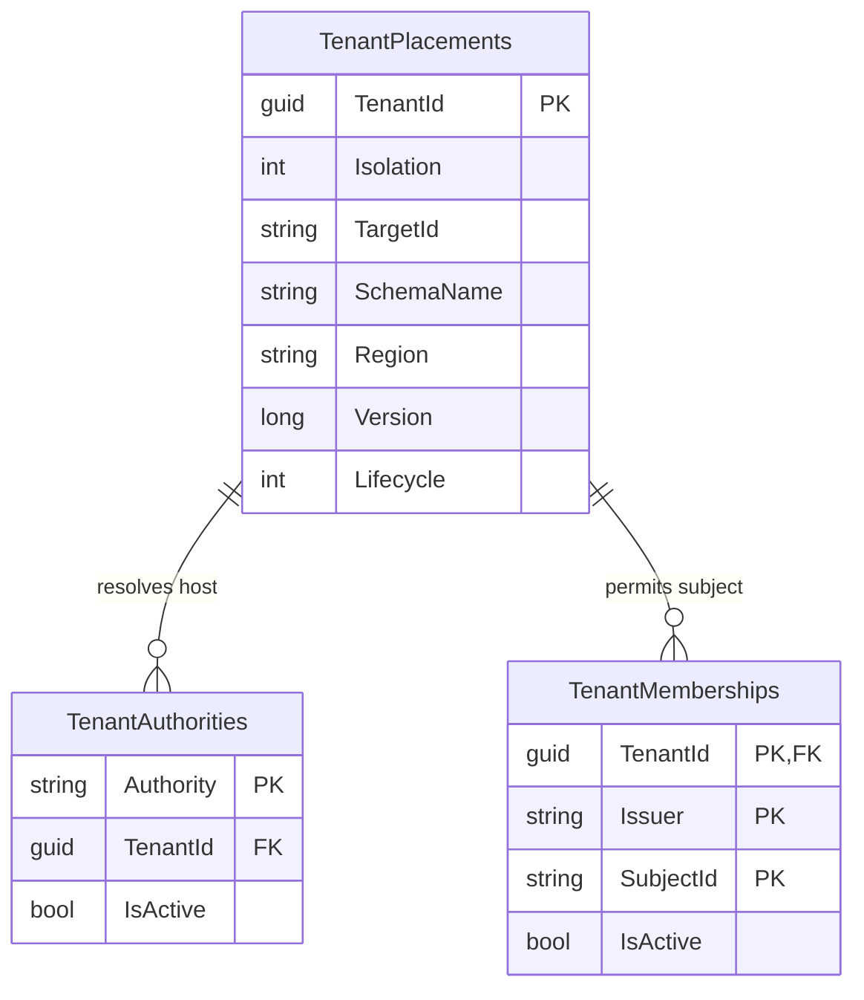

The baseline definitions are [TenantCatalogBaseline.sql](../Infrastructure/Tenancy/Catalog/TenantCatalogBaseline.sql), [TenantAuthorityBaseline.sql](../Infrastructure/Tenancy/Authorization/TenantAuthorityBaseline.sql), and [TenantMembershipBaseline.sql](../Infrastructure/Tenancy/Authorization/TenantMembershipBaseline.sql). These are Admin/release inputs, not scripts run for every web request. The catalog and membership baselines intentionally fail if their tables already exist; they are not general-purpose idempotent upgrades.

The membership key uses a nonclustered primary key because the combined string-key width can exceed the clustered-key limit noted in the SQL source. Binary collation and explicit whitespace validation prevent distinct identity spellings from accidentally becoming the same catalog key.

### 6.2 Writes use an expected revision

Source: [AzureSqlTenantCatalogWriter.cs](../Infrastructure/Tenancy/Catalog/AzureSqlTenantCatalogWriter.cs), excerpt from its SQL command:

```sql
SELECT @CurrentVersion = [Version]
FROM [catalog].[TenantPlacements] WITH (UPDLOCK, HOLDLOCK)
WHERE [TenantId] = @TenantId;
IF @CurrentVersion = @ExpectedVersion
BEGIN
    UPDATE [catalog].[TenantPlacements]
    SET [Isolation] = @Isolation, [TargetId] = @TargetId, [SchemaName] = @SchemaName,
        [Region] = @Region, [Version] = @NewVersion, [Lifecycle] = @Lifecycle
    WHERE [TenantId] = @TenantId;
    SET @Applied = 1;
END
```

The enclosing transaction and lock hints protect the read/compare/write operation. Initial insertion requires expected version zero; subsequent revisions must advance. If another administrator already changed the placement, the writer returns false instead of overwriting newer state.

### 6.3 Redis is disposable placement metadata

Sources: [CachedTenantCatalog.cs](../Infrastructure/Tenancy/Catalog/CachedTenantCatalog.cs), [CachedTenantCatalogWriter.cs](../Infrastructure/Tenancy/Catalog/CachedTenantCatalogWriter.cs), [RedisTenantPlacementCache.cs](../Infrastructure/Tenancy/Caching/RedisTenantPlacementCache.cs), [StackExchangeRedisTenantPlacementTransport.cs](../Infrastructure/Tenancy/Caching/StackExchangeRedisTenantPlacementTransport.cs).

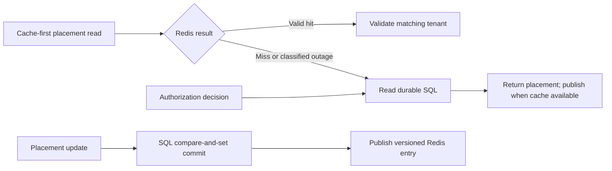

Redis uses one version/payload hash per tenant. Atomic Lua logic compares revisions, updates the payload, and assigns expiry together. It avoids converting full 64-bit placement revisions to floating-point Lua numbers. An equal revision with a different payload is treated as a conflict rather than silently accepted.

The cache validates payload size, serialized content, identity, and revision. Only classified cache transport failures trigger the intended SQL fallback; malformed data is not an ordinary miss. Cache publication follows durable SQL commit. A Redis outage does not undo a completed catalog update.

Expiry or deletion also removes the cache's remembered revision. A delayed old write can matter after that point. For this reason, invalidating Redis is not a relocation fence and does not stop an already running operation against old storage. Authorization uses durable placement, and future relocation needs transaction-time protection too.

## 7. Selecting the database and schema

Sources: [ConfigurationTenantStorageTargetProvider.cs](../Infrastructure/Tenancy/Persistence/ConfigurationTenantStorageTargetProvider.cs), [TenantStorageTarget.cs](../Infrastructure/Tenancy/Persistence/TenantStorageTarget.cs), [TenantStorageContextFactory.cs](../Infrastructure/Tenancy/Persistence/TenantStorageContextFactory.cs).

```csharp
var placement = context.Placement;
if (placement.Isolation != expectedIsolation)
    throw new InvalidOperationException("Storage strategy does not match the authorized placement.");
var target = await targets.ResolveAsync(placement.TargetId, cancellationToken).ConfigureAwait(false);
cancellationToken.ThrowIfCancellationRequested();
if (target.TargetId != placement.TargetId || target.Region != placement.Region || target.Isolation != placement.Isolation)
    throw new InvalidOperationException("Backing target does not match the authorized placement.");
var schema = placement.Isolation == TenantIsolation.Schema ? placement.Schema! : target.Schema;
```

This factory checks the selected strategy and trusted target against the authorized placement before building the context. A schema tenant uses its placement schema. Database and row tenants use the fixed schema from the target definition.

`ConfigurationTenantStorageTargetProvider` reads `Saas:Storage:Targets:{targetId}`. It validates the logical identifier before treating it as a configuration section name. `TenantStorageTarget` normalizes the SQL connection with bounded pool size, a connection timeout, disabled MARS, disabled ambient enlistment, and no persisted security information. It is deliberately a class without record-generated credential-bearing `ToString()` output.

The three small strategy classes implement `ITenantStorageStrategy`:

| Class | Expected isolation |
| --- | --- |
| `DatabaseTenantStorageStrategy` | `Database` |
| `SchemaTenantStorageStrategy` | `Schema` |
| `DiscriminatorTenantStorageStrategy` | `Row` |

They delegate construction to the common factory rather than duplicating connection validation. `TenantDbContextFactory` obtains the current context from `ITenantContextAccessor`, so ordinary callers need not accept tenant connection details as method inputs.

The factory creates fresh EF contexts; it does not use pooled DbContexts. SQL Client connection pooling still operates at the connection level. Those are different kinds of pooling: reusing a physical SQL connection must not imply reusing another request's EF tenant state.

## 8. The tenant-aware EF Core model

### 8.1 Preserve a deliberate legacy model boundary

Source: [AppDbContext.cs](../Infrastructure/Data/EfCore/Persistence/AppDbContext.cs).

```csharp
public Guid TenantId { get; }
public bool IsTenantStorage { get; }
public string StorageSchema => Schema;
protected override bool IncludeModelSeeds => !IsTenantStorage;
```

The tenant constructor sets the ID and `IsTenantStorage`. `OnModelCreating` invokes `TenantModelConfiguration.Apply` only for this mode. The original constructor retains the legacy model so existing consumers are not silently pointed at incompatible tables during a partial rollout. The schema-only Admin constructor is also distinct from the tenant constructor.

The existing Domain entities were not all rewritten to add explicit tenant properties. EF mapping supplies a shadow `TenantId` where necessary. This keeps the storage contract centralized, but it means a developer looking only at `Project.cs` will not see all of its persisted columns.

### 8.2 Tenant ownership belongs in keys and relationships

Source: [TenantModelConfiguration.cs](../Infrastructure/Tenancy/Persistence/TenantModelConfiguration.cs).

```csharp
var tenant = builder.Entity(entity.ClrType).Property<Guid>("TenantId").IsRequired()
    .IsConcurrencyToken().ValueGeneratedNever().Metadata;
foreach (var key in keys[entity])
{
    var replacement = entity.AddKey(new[] { tenant }.Concat(key.Properties).ToArray());
    replacements[key] = replacement;
    if (key.IsPrimaryKey()) entity.SetPrimaryKey(replacement.Properties);
}
```

The transformation prefixes each key with `TenantId`. It then rebuilds foreign keys against the corresponding tenant-prefixed principal keys, removes the old keys, and prefixes indexes while preserving their uniqueness and filters.

An illustrative relationship becomes:

```text
Projects primary key:       (TenantId, Id)
ProjectTasks primary key:   (TenantId, Id)
ProjectTasks project link:  (TenantId, ProjectId) -> Projects(TenantId, Id)
```

A task in organization A therefore cannot refer to organization B's project merely by copying a project number. Tenant isolation is expressed in the database relationship, not only in a query predicate.

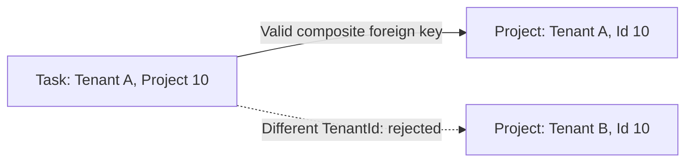

Composite keys disable conventional integer identity generation, so the mapping explicitly restores `UseIdentityColumn()` for the original single integer ID properties. It also bounds otherwise-unbounded string key properties. The mapping fails explicitly for owned types, inheritance roots with unsupported shape, or keyless types, rather than silently excluding them from isolation.

### 8.3 Query filters use the current context

Source: the same model configuration.

```csharp
var tenantAccess = Expression.Call(typeof(EF), nameof(EF.Property), new[] { typeof(Guid) },
    parameter, Expression.Constant("TenantId"));
Expression predicate = Expression.Equal(tenantAccess,
    Expression.Property(Expression.Constant(context), nameof(AppDbContext.TenantId)));
if (typeof(ISoftDeletable).IsAssignableFrom(entity.ClrType))
    predicate = Expression.AndAlso(predicate,
        Expression.Not(Expression.Property(parameter, nameof(ISoftDeletable.IsDeleted))));
builder.Entity(entity.ClrType).HasQueryFilter(Expression.Lambda(predicate, parameter));
```

This builds a filter for every mapped entity. For a soft-deletable project, the effective condition is conceptually `TenantId == currentTenant && !IsDeleted`. Identity users and refresh tokens are included in the model transformation too.

**Illustrative LINQ equivalent for learning:**

```csharp
modelBuilder.Entity<Project>().HasQueryFilter(project =>
    EF.Property<Guid>(project, "TenantId") == TenantId && !project.IsDeleted);
```

The implementation uses expressions because it applies the convention across multiple entity types. Tenant values come from the context; they must not be frozen into the model as a constant belonging to the first request.

### 8.4 EF model caching must distinguish schemas

Source: [TenantModelCacheKeyFactory.cs](../Infrastructure/Tenancy/Persistence/TenantModelCacheKeyFactory.cs).

```csharp
public object Create(DbContext context, bool designTime) => context is AppDbContext app
    ? (context.GetType(), app.IsTenantStorage, app.StorageSchema, designTime)
    : (object)(context.GetType(), designTime);
```

Two schema tenants need different models because `[atlas].[Projects]` and `[beacon].[Projects]` are different table mappings. Two row tenants using the same schema can share model metadata while supplying different filter parameters. The key therefore includes schema and legacy/tenant mode, but not tenant ID.

Including every tenant ID would create needless model growth for shared-row tenants. Omitting schema could cause the second tenant to reuse the first tenant's table mapping.

### 8.5 Reads and writes need separate protection

Source: `GuardTenantWrites` in [AppDbContext.cs](../Infrastructure/Data/EfCore/Persistence/AppDbContext.cs).

```csharp
var tenant = entry.Property("TenantId");
if (entry.State == EntityState.Added && (Guid)tenant.CurrentValue! == Guid.Empty)
    tenant.CurrentValue = TenantId;
if ((Guid)tenant.CurrentValue! != TenantId ||
    (entry.State != EntityState.Added && (Guid)tenant.OriginalValue! != TenantId))
    throw new InvalidOperationException("Cross-organization or unbound writes are forbidden.");
```

New entities get the current tenant when ownership is empty. An explicitly forged tenant is rejected. Updates and deletes require both original and current ownership to match, preventing detached, unbound entities from being attached and written under an assumed tenant.

Every synchronous and asynchronous `SaveChanges` overload reaches the guard. [ServiceDbContext.cs](../Infrastructure/Data/EfCore/Extensions/ServiceDbContext.cs) continues to stamp audit fields beneath it.

Query filters do not protect arbitrary SQL or replace authorization. EF operations that bypass the change tracker do not automatically execute this SaveChanges guard. Such paths require review of their own tenant constraints and the database enforcement described next.

## 9. SQL row-level security

Row isolation adds a database-side boundary because a shared table cannot rely on every future application query being written correctly.

### 9.1 Set ownership when a connection opens

Source: [TenantSqlSessionInterceptor.cs](../Infrastructure/Tenancy/Persistence/TenantSqlSessionInterceptor.cs), excerpt from the command it executes.

```sql
EXEC sys.sp_set_session_context @key=N'TenantId', @value=@tenant, @read_only=1;
DECLARE @policy int = (
    SELECT object_id FROM sys.security_policies
    WHERE schema_id=SCHEMA_ID(@schema) AND name=N'TenantIsolationPolicy' AND is_enabled=1);
IF @policy IS NULL
    THROW 51001, 'Tenant row security is not installed or enabled.', 1;
```

The tenant value and schema are parameters. The interceptor handles both sync and async connection opening. If setting the context or checking policy coverage fails, it closes the connection and fails the operation. It also checks that tenant tables have filter and insert/update block predicates, so an incomplete deployment does not quietly run unprotected.

The interceptor is installed only for row isolation. A healthy database-isolated tenant should not fail simply because its database has no shared-row security policy.

### 9.2 Filter reads and block invalid writes

Source: [TenantRowSecurityScript.cs](../Infrastructure/Tenancy/Persistence/TenantRowSecurityScript.cs). The generated predicate has this shape; schema/table names below are an **illustrative expansion** for `dbo`:

```sql
CREATE OR ALTER FUNCTION [dbo].[TenantAccessPredicate](@TenantId uniqueidentifier)
RETURNS TABLE WITH SCHEMABINDING
AS RETURN
    SELECT 1 AS Allowed
    WHERE @TenantId = TRY_CONVERT(uniqueidentifier, SESSION_CONTEXT(N'TenantId'));

-- The generated security policy applies these to every tenant table:
ADD FILTER PREDICATE [dbo].[TenantAccessPredicate]([TenantId]) ON [dbo].[Projects],
ADD BLOCK PREDICATE [dbo].[TenantAccessPredicate]([TenantId]) ON [dbo].[Projects] AFTER INSERT,
ADD BLOCK PREDICATE [dbo].[TenantAccessPredicate]([TenantId]) ON [dbo].[Projects] AFTER UPDATE
```

The function permits rows whose tenant matches the session. Filter predicates limit visible rows; block predicates reject inserted or updated rows with inappropriate ownership. The generator quotes identifiers and rebuilds policy/function definitions transactionally. This is Admin work, not request-time DDL.

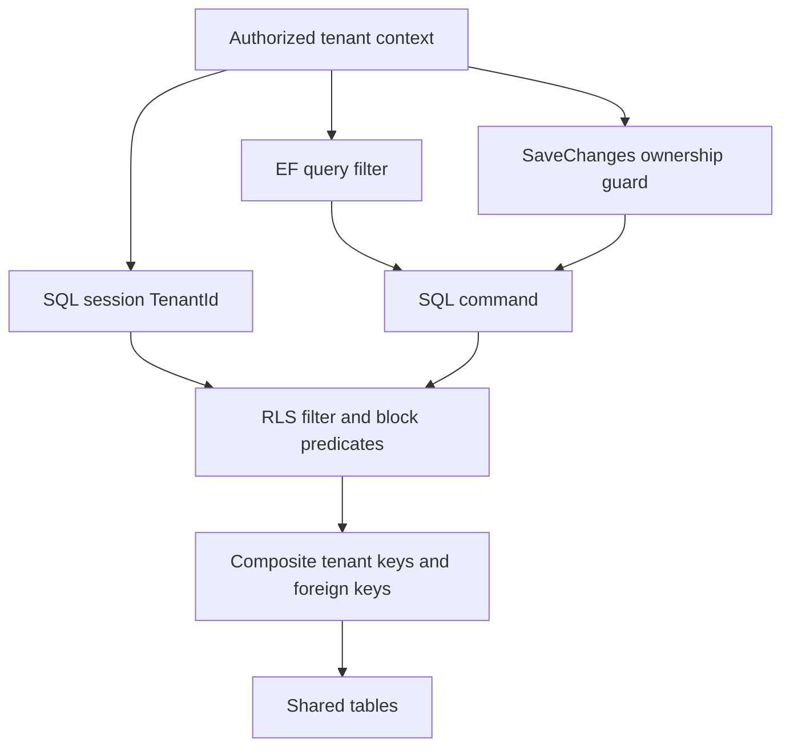

These protections address different failure modes. Production SQL principals must also have appropriate object permissions and must not be able to disable policies or rewrite the schema. The local environment uses `sa` for convenience; it is not the model for production privilege separation. Connection-pool reuse, bulk commands, privileged maintenance, and transaction-time relocation still require live-provider tests.

## 10. Identity, tokens, and application handlers

### 10.1 Identity lookups must understand composite keys

Source: [TenantIdentityStores.cs](../Infrastructure/Tenancy/Persistence/TenantIdentityStores.cs).

```csharp
return Context.Users.FindAsync(
    new object[] { Context.TenantId, ConvertIdFromString(userId) },
    cancellationToken).AsTask();
```

After `Users` becomes keyed by `(TenantId, Id)`, a standard one-value primary-key lookup is insufficient. `TenantUserStore` adapts user, user-role, and user-token key lookups; `TenantRoleStore` adapts role lookup. Their constructors reject a non-tenant context.

The same principle applies when extending business handlers: review `Find`, `FindAsync`, attachments, relationships, and direct key operations whenever a primary key changes shape. Tenant-filtered LINQ queries and composite-key lookups serve different purposes.

### 10.2 Bind issued tokens to the organization

Source: [AuthService.cs](../Infrastructure/Services/AuthService.cs).

```csharp
claims.Add(new Claim(TenantPrincipalAccess.TenantIdClaimType,
    tenantContext?.Current.Placement.TenantId.ToString("D")
    ?? throw new InvalidOperationException()));
```

The surrounding try/catch deliberately allows legacy token issuance to continue without a tenant claim when no context exists. That compatibility behavior is another reason not to assume all existing login flows already issue organization-bound shared-service tokens.

Source: [LocalTenantRegistration.cs](../Api/Tenancy/LocalTenantRegistration.cs).

```csharp
options.Events.OnTokenValidated = context =>
{
    if (context.Principal?.FindFirst("tenant_id")?.Value != binding.Current.Placement.TenantId.ToString("D"))
        context.Fail("Token belongs to another company.");
    return Task.CompletedTask;
};
```

The local API checks its fixed company after ordinary JWT validation. The launcher also gives each company its own issuer, audience, and refresh-cookie name. Cookies are not isolated by localhost port, so distinct cookie names prevent one company's refresh cookie from replacing another's.

### 10.3 Existing business authorization still matters

Tenant ownership answers which organization's records are eligible. Project membership and roles answer which eligible records a particular user may access. Keep both checks.

For example, [Project/List/Handler.cs](../Application/Features/Project/List/Handler.cs) retains the non-admin project-member filter while its underlying context applies tenant filters. Its list cache key is also wrapped with the tenant namespace. Similar changes appear in dashboard, task, menu, and project handlers and selected write endpoints.

## 11. Application and HTTP cache isolation

Two companies can have a user with the same integer ID. A key based only on `userId = 1` and query parameters is therefore not a safe shared cache key.

Source: [TenantCacheKeyBuilder.cs](../Infrastructure/Caching/Keys/TenantCacheKeyBuilder.cs).

```csharp
return $"tenant:{_contextAccessor.Current.Placement.TenantId:D}";
```

The builder passes this scope and the original key to the common key generator. When context is not established, its compatibility path uses a separate `legacy` namespace. That fallback avoids collisions with tenant entries; it does not authorize a request that forgot to establish its context.

Source: [Project/List/Handler.cs](../Application/Features/Project/List/Handler.cs).

```csharp
cacheKey = tenantKeys?.Build(cacheKey) ?? cacheKey;
var cachedResponse = await cacheService.GetAsync<Response>(cacheKey, cancellationToken);
```

The optional dependency supports legacy callers. In the tenant composition it must resolve successfully. Invalidation must use the same prefix as reads; otherwise a write leaves the actual tenant-scoped entry stale.

Source: [Task/Update/Handler.cs](../Application/Features/Task/Update/Handler.cs).

```csharp
await cacheService.RemoveByPatternAsync(tenantKeys?.BuildPattern("tasks:list:*") ?? "tasks:list:*", cancellationToken);
await cacheService.RemoveByPatternAsync(tenantKeys?.BuildPattern("tasks:board:*") ?? "tasks:board:*", cancellationToken);
await cacheService.RemoveByPatternAsync(tenantKeys?.BuildPattern("dashboard:summary:*") ?? "dashboard:summary:*", cancellationToken);
```

[HttpResponseCacheKeyBuilder.cs](../Infrastructure/Caching/Keys/HttpResponseCacheKeyBuilder.cs) also incorporates tenant scope alongside route, user, query, and header components. [HttpResponseCachingMiddleware.cs](../Infrastructure/Caching/Middlewears/HttpResponseCachingMiddleware.cs) contains the authenticated-response policy. Tenant authorization marks responses `no-store`; HTTP caching must remain compatible with that boundary rather than serving a response before access is validated.

The branch also updates [EntityFrameworkQueryCachingExtensions.cs](../Infrastructure/Data/EfCore/Extensions/EntityFrameworkQueryCachingExtensions.cs) and [EntityFrameworkCacheInvalidationInterceptor.cs](../Infrastructure/Data/EfCore/Interceptors/EntityFrameworkCacheInvalidationInterceptor.cs). When adding a cached feature, trace both cache creation and eviction, not only the handler's initial read. Local per-company Memory caches reduce sharing in the demo, but they do not remove the need for correct keys in a future shared Redis deployment.

## 12. Schema creation, migrations, and provisioning

### 12.1 Keep DDL out of normal API startup

[Admin/Program.cs](../Admin/Program.cs) exposes `local-init`, `migrate`, and `provision`. Separating administration allows web processes to use narrower permissions and prevents several API replicas from racing to change the same schema.

The repository retains legacy migration helper classes in [MigrationExtensions.cs](../Infrastructure/Data/EfCore/Extensions/MigrationExtensions.cs). Their existence does not mean tenant schema creation runs automatically in the web composition. Follow registrations and executable entry points, not just class names.

### 12.2 Local bootstrap creates the actual tenant model

Source: [LocalTenantBootstrap.cs](../Admin/LocalTenantBootstrap.cs).

```csharp
if (!database.StartsWith("StmsLocal", StringComparison.Ordinal))
    throw new InvalidOperationException("Local bootstrap requires a StmsLocal database.");
```

The binding additionally requires `LocalDocker`. These checks constrain an intentionally privileged local initializer.

```csharp
var script = admin.Database.GenerateCreateScript();
foreach (var batch in System.Text.RegularExpressions.Regex.Split(script, @"^GO\s*$",
             System.Text.RegularExpressions.RegexOptions.Multiline))
    if (!string.IsNullOrWhiteSpace(batch))
        await admin.Database.ExecuteSqlRawAsync(batch, token);
```

For an empty schema, the initializer generates SQL from the tenant-aware EF model, including composite keys. It does not use the old fixed-schema migrations as an upgrade path. It then installs row security for row storage and inserts navigation through a tenant-bound context. Shared-tier initializers are serialized by Compose so they do not create the same tables concurrently.

This procedure is appropriate for disposable empty local schemas. It will not transform a populated legacy schema into a tenant-aware one.

### 12.3 Migration orchestration operates on physical targets

Sources: [TenantMigrationRunner.cs](../Infrastructure/Tenancy/Migrations/TenantMigrationRunner.cs), [ConfigurationMigrationTargetSource.cs](../Infrastructure/Tenancy/Migrations/ConfigurationMigrationTargetSource.cs), [SqlMigrationTargetLockProvider.cs](../Infrastructure/Tenancy/Migrations/SqlMigrationTargetLockProvider.cs), [SqlMigrationLedger.cs](../Infrastructure/Tenancy/Migrations/SqlMigrationLedger.cs).

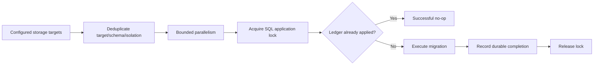

Source: the runner's per-target operation.

```csharp
await using var lease = await _locks.AcquireAsync(target, cancellationToken).ConfigureAwait(false);
cancellationToken.ThrowIfCancellationRequested();

if (await _ledger.IsAppliedAsync(target, cancellationToken).ConfigureAwait(false))
    return new MigrationOutcome(target, true, null);

await _executor.ExecuteAsync(target, cancellationToken).ConfigureAwait(false);
cancellationToken.ThrowIfCancellationRequested();
await _ledger.RecordAppliedAsync(target, cancellationToken).ConfigureAwait(false);
```

One shared-row database should be migrated once per physical target, not once for each tenant occupying its rows. Schema storage adds schema to the target identity. The production registration chooses SQL locks and the SQL ledger; in-memory equivalents exist for tests/single-process scenarios.

Two current limitations matter before a production migration rollout:

* [SqlMigrationTargetExecutor.cs](../Infrastructure/Tenancy/Migrations/SqlMigrationTargetExecutor.cs) invokes existing EF migrations using the schema-only context constructor. It does not use the local initializer's full tenant-model creation path. A tenant-aware baseline/backfill/upgrade must be supplied and validated; choosing a different migration-history schema does not rewrite hard-coded table schemas inside old migrations.
* The outer `__SaasMigrationLedger` key is target/schema/isolation, without a release or migration revision. Once marked applied, the runner can skip that target on later releases. Extend the ledger/check logic before using it as a recurring schema-upgrade mechanism.

These are integration boundaries of the current code, not tasks that the local demo silently completes.

### 12.4 Provision before activating

Source: [TenantProvisioner.cs](../Infrastructure/Tenancy/Provisioning/TenantProvisioner.cs).

```csharp
if (!await _catalogWriter.TrySaveAsync(provisioning, expectedVersion: 0, cancellationToken).ConfigureAwait(false))
    throw new TenantProvisioningException("TENANT_ALREADY_PROVISIONING", "The organization already has a placement.");

await _executor.ExecuteAsync(provisioning, cancellationToken).ConfigureAwait(false);
cancellationToken.ThrowIfCancellationRequested();
await _executor.ValidateAsync(provisioning, cancellationToken).ConfigureAwait(false);
```

The provisioner first writes a non-active placement. After execution and validation, it constructs an `Active` placement at the next revision and commits it with the expected previous version. Failed execution never intentionally activates the tenant.

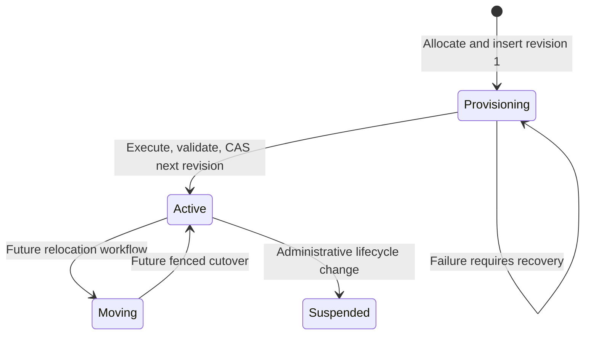

The implemented allocator reads templates from `Saas:Provisioning:Defaults:{Isolation}`. It does not choose capacity dynamically or generate a unique schema per new customer. The registered provisioning lock is process-local. The executor's validation checks target consistency and connectivity, not every tenant table/permission invariant. Durable retries, distributed provisioning coordination, unique allocation, and deeper readiness validation remain work for a production onboarding service.

## 13. Background jobs and resource limits

Sources: [AdministrationContracts.cs](../Application/Tenancy/AdministrationContracts.cs), [TenantWorker.cs](../Infrastructure/Tenancy/Resilience/TenantWorker.cs), [TenantAdmissionPolicy.cs](../Infrastructure/Tenancy/Resilience/TenantAdmissionPolicy.cs).

A queued job carries tenant identity and placement information. It must not simply run later using whatever request context happened to enqueue it.

Source: the worker's stale-placement check.

```csharp
if (current is null || current.Lifecycle != TenantLifecycle.Active ||
    current.Version != item.PlacementVersion || current.TargetId != item.TargetId ||
    current.Isolation != item.Isolation)
{
    await _deduplicator.CompleteAsync(item.JobId, cancellationToken).ConfigureAwait(false);
    await _queue.CompleteAsync(item, cancellationToken).ConfigureAwait(false);
    _logger.LogInformation("Rejected stale tenant job {JobId} for organization {TenantId}.",
        item.JobId, item.TenantId);
    return;
}
```

The worker rereads durable placement, creates a fresh scope, reauthorizes the job identity, initializes that scope, and resolves `ITenantWorkHandler`. This prevents a job queued for an old placement from automatically writing after a move. It is a start-time check; a placement change during the handler still needs persistence-level fencing.

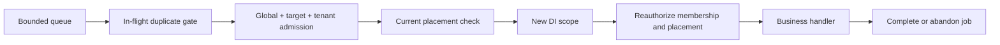

Admission defaults are 32 concurrent operations globally, 16 per target, 4 per tenant, with a 250 ms admission wait setting. These gates are process-local; adding replicas multiplies aggregate capacity. They are not automatically the web API's tenant-aware rate limiter. The existing HTTP limiter is separately configured in bootstrap.

[ChannelTenantJobQueue.cs](../Infrastructure/Tenancy/Resilience/ChannelTenantJobQueue.cs) is a bounded in-process channel with default capacity 256. It is not durable across restarts. The in-memory deduplicator suppresses concurrent duplicates and removes the entry on completion; it is not a durable record of completed job IDs. Production needs a durable queue, retry/dead-letter policy, and idempotent business effects.

[Worker/Program.cs](../Worker/Program.cs) exits with an explanatory error unless a real `ITenantWorkHandler` adapter is registered. The AKS chart sets `worker.enabled: false`. A worker image existing in the repository does not mean useful background processing is already deployed.

## 14. Configuration ownership and dependency injection

### 14.1 Separate organization data from deployment settings

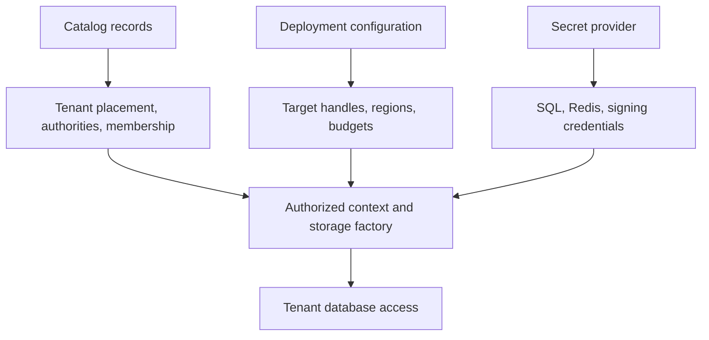

Do not encode all production organizations in `appsettings.json`. Catalog records change as customers join, suspend access, or move. Configuration describes infrastructure and operating limits. Credentials belong to the deployment's secret mechanism. The local `companies.json` inventory is an explicit demo exception.

The application uses normal .NET configuration supplied to `WebApplication.CreateBuilder` and `Host.CreateApplicationBuilder`. Hierarchical keys can be represented with `__` in environment variables. Registering an options section is not equivalent to adding an Azure App Configuration provider: any provider/refresh integration must actually be configured by the host or delivery process.

### 14.2 Shared-service settings

| Section | Important settings and defaults | Consumer |
| --- | --- | --- |
| `Saas:TenantCatalog:Sql` | Required connection; connect timeout 15 s; pool size 100 | `SqlTenantCatalogConnectionFactory` |
| `Saas:TenantCatalog:Read` | Command timeout 15 s; total lookup timeout 30 s | Catalog, authority, membership readers and catalog writer |
| `Saas:TenantCatalog:Cache` | Prefix `stms`; absolute expiration 5 min; payload max 32 KiB | `RedisTenantPlacementCache` |
| `Saas:TenantCatalog:Redis` | Required connection; database -1; command wait 2000 ms | Placement Redis connection/transport |
| `Saas:Tenancy:SharedApiAuthorities` | Array of exact normalized shared API authorities | Request resolver |
| `Saas:Storage:Targets:{targetId}` | Isolation, region, schema, connection; pool 50; command timeout 30 s | Storage target provider |
| `Saas:Migration` | `MaxConcurrency`, default 2 | Admin migration runner |
| `Saas:Provisioning:Defaults:{Database|Schema|Row}` | TargetId, Region, and Schema for schema mode | Placement allocator |
| `Saas:Resilience` | Global/per-target/per-tenant limits and wait budget | Admission policy |
| Worker options integration | `TenantWorkerOptions.MaxInFlightJobs` defaults to 32; no configuration binding is currently registered | `TenantWorker` |

Defaults above are code defaults; Helm or environment settings can override them. Required connections are not optional simply because service registration itself performs no I/O. Validation generally occurs when the configured provider is resolved.

The worker option is a specific exception to the override statement: the chart emits `Saas__Resilience__MaxInFlightJobs`, but `AddTenantWorker` does not bind `TenantWorkerOptions` to that section. Complete this registration before expecting the chart value to alter the worker's default. An environment variable alone cannot configure an options class that the host never binds.

**Illustrative external configuration shape, with placeholders rather than real credentials:**

```json
{
  "Saas": {
    "TenantCatalog": {
      "Sql": { "ConnectionString": "<control-plane SQL connection>" },
      "Read": { "CommandTimeoutSeconds": 15, "LookupTimeoutSeconds": 30 },
      "Redis": { "ConnectionString": "<placement Redis connection>" },
      "Cache": { "KeyPrefix": "stms-dev", "AbsoluteExpiration": "00:05:00" }
    },
    "Tenancy": { "SharedApiAuthorities": ["api.example.test"] },
    "Storage": {
      "Targets": {
        "shared-east": {
          "Isolation": "Row",
          "Region": "southeastasia",
          "Schema": "dbo",
          "ConnectionString": "<tenant-data SQL connection>",
          "MaxPoolSize": 50,
          "CommandTimeoutSeconds": 30
        }
      }
    }
  }
}
```

For example, `Saas:Storage:Targets:shared-east:ConnectionString` becomes `Saas__Storage__Targets__shared-east__ConnectionString` in the environment. Do not paste the illustrative placeholders into a runnable deployment and expect a connection.

### 14.3 Local-only settings

| Input | Purpose |
| --- | --- |
| `deploy/local/settings.json` → `frontendClient` | Persistent Angular/React selection for the launcher |
| `-FrontendClient` | One-run override; allowed values Angular or React |
| `deploy/local/companies.json` | Fictional tenant ID, slug, storage tier/schema, web port and API port |
| `ASPNETCORE_ENVIRONMENT` and `DOTNET_ENVIRONMENT` = `LocalDocker` | Enable local binding and Admin local initializer |
| `LocalTenant__Id`, `Isolation`, `Schema`, `Target` | Fixed API organization and placement |
| `ConnectionStrings__DefaultConnection` | SQL target for that company container |
| `Jwt__Issuer`, `Jwt__Audience`, `Jwt__Key` | Local token validation and issuance |
| `Authentication__RefreshTokenCookieName` | Company-specific refresh cookie |
| `Caching__Provider=Memory`, company key prefix | Local application cache |
| `Ai__Enabled=false` | Local run does not depend on AI credentials |

The local environment uses neither the production placement catalog nor the placement Redis cache. Ordinary direct `dotnet run` with a Development profile is therefore not the same execution path as the nine-company `LocalDocker` environment.

### 14.4 Lifetimes are part of the isolation design

| Service | Lifetime/ownership | Reason |
| --- | --- | --- |
| `TenantContextScope` | Scoped | One immutable request/job context |
| `AppDbContext` in LocalDocker | Scoped, freshly constructed | No change tracker shared across requests |
| `TenantDbContextFactory` / storage strategies | Scoped | Consume the current authorized scope |
| Catalog/Redis infrastructure | Singleton registrations | Shared bounded infrastructure without per-request mutable tenant state |
| `LocalTenantBinding` | Singleton per local API | API container represents one fixed company |
| Admission policy | Singleton per process | Requests/jobs share the same concurrency gates within that process |

The source registrations are [TenantCatalogServiceCollectionExtensions.cs](../Infrastructure/Tenancy/Catalog/TenantCatalogServiceCollectionExtensions.cs), [TenantPipeline.cs](../Api/Tenancy/TenantPipeline.cs), [TenantStorageContextFactory.cs](../Infrastructure/Tenancy/Persistence/TenantStorageContextFactory.cs), and [LocalTenantRegistration.cs](../Api/Tenancy/LocalTenantRegistration.cs).

## 15. Docker and the local company topology

### 15.1 Image responsibilities

| Image source | Responsibility |
| --- | --- |
| [Dockerfile.api](../Dockerfile.api) | Build/publish API; run on port 8080 under the .NET non-root app user |
| [Dockerfile.admin](../Dockerfile.admin) | Build/publish Admin; run `local-init`, migrations, or provisioning as an explicit operation |
| [Dockerfile.worker](../Dockerfile.worker) | Build/publish Worker; requires runtime adapters before useful operation |
| [Angular/Dockerfile](../Frontend/Angular/Dockerfile) | Build Angular production files; serve through unprivileged Nginx |
| [React/Dockerfile](../Frontend/React/Dockerfile) | Build React with `/services` API base; serve through unprivileged Nginx |

Source: API runtime stage.

```dockerfile
FROM mcr.microsoft.com/dotnet/aspnet:10.0 AS runtime
WORKDIR /app
ENV ASPNETCORE_URLS=http://+:8080 DOTNET_EnableDiagnostics=0
EXPOSE 8080
COPY --from=build /out .
USER $APP_UID
ENTRYPOINT ["dotnet", "Api.dll"]
```

The SDK is used in the build stage; the final image contains published runtime output. One API image is reused for every company, with different environment variables. Tenant-specific binaries are unnecessary.

### 15.2 Local inventory

Source: [companies.json](../deploy/local/companies.json).

| Company | Isolation | SQL container / database / schema | Web | API |
| --- | --- | --- | --- | --- |
| Titan | Database | sql-dedicated / StmsLocaldedicated / dbo | 8101 | 9101 |
| Atlas | Schema | sql-schema / StmsLocalschema / atlas | 8201 | 9201 |
| Beacon | Schema | sql-schema / StmsLocalschema / beacon | 8202 | 9202 |
| Cedar | Schema | sql-schema / StmsLocalschema / cedar | 8203 | 9203 |
| Delta | Row | sql-row / StmsLocalrow / dbo | 8301 | 9301 |
| Ember | Row | sql-row / StmsLocalrow / dbo | 8302 | 9302 |
| Fern | Row | sql-row / StmsLocalrow / dbo | 8303 | 9303 |
| Grove | Row | sql-row / StmsLocalrow / dbo | 8304 | 9304 |
| Harbor | Row | sql-row / StmsLocalrow / dbo | 8305 | 9305 |

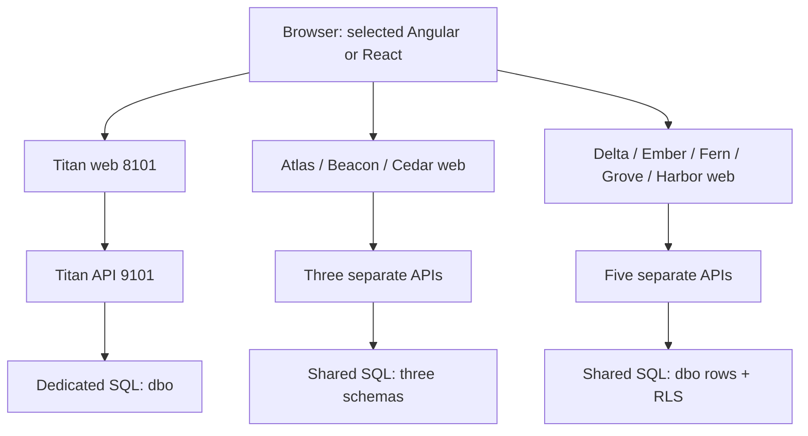

The steady-state count is 26: nine APIs, nine web containers, three SQL containers, and five telemetry services. Nine initializer containers additionally exit successfully. SQL has no published host port; web/API ports bind to loopback. Three SQL instances are configured with 2 GB limits each, so allow sufficient Docker memory beyond the application and telemetry processes.

### 15.3 Startup dependencies express readiness

Source: [Start-LocalSaas.ps1](../deploy/local/Start-LocalSaas.ps1).

```powershell
$dependencies = @{ "sql-$tier" = @{ condition = 'service_healthy' } }
if ($lastInit.ContainsKey($tier)) { $dependencies[$lastInit[$tier]] = @{ condition = 'service_completed_successfully' } }
```

The initializer waits for SQL to accept a real query. Within a shared tier, the next initializer also waits for the prior one to finish. APIs wait for their initializer, and web containers wait for their API health check. A container existing or reporting `Starting` does not prove its dependency is ready.

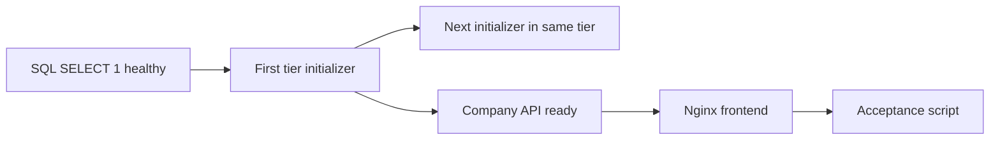

### 15.4 Browser API calls remain company-specific

Generated Nginx configuration contains:

```nginx
location /services/api/ {
    proxy_pass http://API_SERVICE:8080/api/;
    proxy_set_header Host $host;
    proxy_set_header X-Forwarded-Proto $scheme;
}
location / { try_files $uri $uri/ /index.html; }
```

The launcher replaces `API_SERVICE` with the company service name, such as `api-titan`. A call to `http://localhost:8101/services/api/projects/` reaches Titan's API. SPA fallback serves deep browser routes such as `/dashboard` from `index.html`.

Angular consumes the generated `window.__STMS_TENANT__` value in [app.config.ts](../Frontend/Angular/src/app/app.config.ts). Its [tenant interceptor](../Frontend/Angular/src/app/core/tenancy/tenant.interceptor.ts) checks API scope, adds tenant selection where appropriate, and cancels operations when browser tenant context changes. The auth interceptor participates in preventing requests from outliving their organization context. The interceptor is registered in the current `app.config.ts`; an older comment describing it as unregistered is not the current composition.

React uses the same-origin `/services` base configured in [env.ts](../Frontend/React/src/config/env.ts) and the local Nginx route. It does not implement the same organization-selection store as Angular. Neither client-side context nor a header grants permission; the local API's server binding owns placement.

### 15.5 Two Compose entry points have different purposes

The generated `deploy/local/generated/compose.json` is the nine-company acceptance environment. The root [docker-compose.saas.yml](../docker-compose.saas.yml) is a separate simpler stack with one API/frontend and shared infrastructure. Setting `FRONTEND_CLIENT=React` changes that file's frontend build directory; it does not turn it into the nine-company topology or configure the full shared-service control plane.

For learning and switching the working local company demo, use `Start-LocalSaas.ps1`.

## 16. Running Angular or React locally

Use PowerShell 7, Docker Desktop with Linux containers, and the `saas` working tree. Container builds install the build dependencies inside images; host .NET/Node installations are needed only for direct development or host-side build/test commands.

From the repository root:

```powershell
# Disposable local startup with React.
./deploy/local/Start-LocalSaas.ps1 -FrontendClient React

# Switch to Angular on the next start.
./deploy/local/Start-LocalSaas.ps1 -FrontendClient Angular
```

Or edit [settings.json](../deploy/local/settings.json):

```json
{
  "frontendClient": "React"
}
```

Then run `./deploy/local/Start-LocalSaas.ps1`. The parameter overrides the file for one run. Angular is the shipped default; choosing a frontend does not change tenant isolation semantics.

### 16.1 What a start actually does

1. Validate frontend selection and Docker availability.
2. If a previously generated Compose file exists, run `down --volumes --remove-orphans` for the project described there.
3. Reuse the generated secret file, or generate it if missing.
4. Read company inventory and generate Compose, Nginx, and browser tenant configuration.
5. Build API, Admin, and the selected web image once, then reuse those images across companies.
6. Start the stack and execute the acceptance script.

The reset is intentional for this disposable development environment. It removes the prior Compose project's database and telemetry volumes, not Docker images or arbitrary projects. `-SkipBuild` skips image rebuilding; it does **not** skip the data reset. Use it only when the selected image is already built and source changes do not need rebuilding.

`-GenerateOnly` writes configuration without Docker startup or teardown. It still updates the generated Compose file. Because later cleanup uses that file, do not use it to overwrite the record of a differently named running project and expect the next run to discover that old project automatically. `-ProjectName` is an advanced override; ordinary Angular/React switching should retain the default `stms-local` name.

### 16.2 Login and password behavior

Open [Titan](http://localhost:8101) and sign in as `admin@titan.example.test`. The other companies use `admin@<slug>.example.test` at their own ports.

Display only the login password from the repository root:

```powershell
(Get-Content ./deploy/local/generated/secrets.json -Raw | ConvertFrom-Json).userPassword
```

The password file contains SQL, JWT, and demo-user secrets. The launcher generates it only when it does not exist. **Resetting Docker volumes does not regenerate this file or change the login password.** Fresh databases are recreated, and the acceptance script registers the demo accounts using the retained `userPassword`.

If startup fails before acceptance reaches registration, the demo user may not exist yet. Fix the dependency failure and rerun the acceptance script after the APIs are ready. Do not infer that a rejected login means the displayed generated password is wrong.

### 16.3 Verification and troubleshooting

```powershell
docker compose -f deploy/local/generated/compose.json ps -a
./deploy/local/Test-LocalSaas.ps1

# Inspect a failing tier and initializer.
docker compose -f deploy/local/generated/compose.json logs --tail 80 sql-schema init-atlas

# Inspect a company's API.
docker compose -f deploy/local/generated/compose.json logs --tail 80 api-titan

# Stop processes without performing a new startup/reset.
docker compose -f deploy/local/generated/compose.json stop
```

| Symptom | Meaning / next check |
| --- | --- |
| SQL is unhealthy, initializer remains Starting | Inspect SQL logs and health output first; initializers depend on SQL |
| `Login failed for user 'sa'` | A retained SQL volume and the generated password disagree; the normal disposable reset should remove volumes belonging to the recorded project |
| Initializer exits nonzero | Read Admin logs for model creation, schema, or policy errors |
| API cannot become ready | Read API logs; local readiness queries the tenant Users table |
| Port already allocated | Inspect running Compose projects; an older custom project may still own the same host ports |
| React page loads but calls fail | Verify `/services/api/` proxy and selected image; distinguish direct Vite development from company Docker hosting |
| Demo login fails after incomplete start | Confirm the acceptance script created the account for that company |

The check report is `deploy/local/generated/verification.json`. Read its timestamp: it describes the run that wrote it, not continuous monitoring of the current stack. Generated files are excluded from Git; never add them to the deployment artifact as a source of production credentials.

## 17. Observability and health checks

Sources: [RequestTracingMiddleware.cs](../Infrastructure/Bootstrap/Middleware/RequestTracingMiddleware.cs), [AuditLoggingMiddleware.cs](../Infrastructure/Bootstrap/Middleware/AuditLoggingMiddleware.cs), [ObservabilityExtensions.cs](../Infrastructure/Bootstrap/ObservabilityExtensions.cs), [LokiHttpSink.cs](../Infrastructure/Bootstrap/LokiHttpSink.cs), [observability configuration](../deploy/observability).

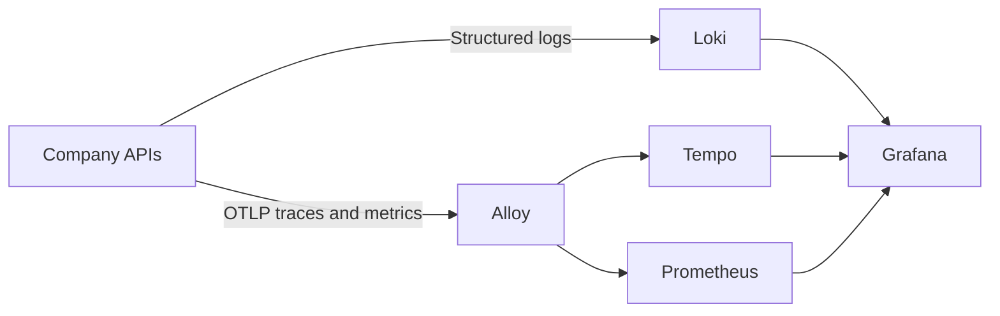

Tenant context is useful for correlating request traces and auditing ownership. Telemetry does not authorize access. Avoid recording tokens or connection strings, and control tenant-label cardinality as the customer count grows. The local Loki tenant label is an observability grouping, not the application's access-control boundary.

There is also an ordering detail: request tracing begins before shared tenant authorization initializes the context, so its early tenant field can be null on that path. Audit middleware runs after authorization. If adding tenant trace enrichment for the shared API, place it after context establishment or enrich the activity when authorization succeeds. The fixed local binding is already available earlier in the pipeline.

| Endpoint/service | Local use |
| --- | --- |
| API `/alive` | Liveness endpoint with no registered checks selected |
| API `/ready` and `/health` | Run health checks; LocalDocker adds a tenant-storage query |
| Web `/health` | Nginx process-level response; does not execute a browser login |
| Grafana `http://localhost:3000` | Local dashboards; configured local credentials `admin` / `admin` |
| Loki `http://localhost:3100/ready` | Log backend readiness |
| Tempo `http://localhost:3200/ready` | Trace backend readiness |
| Prometheus `http://localhost:9090/-/ready` | Metrics backend readiness |

`Api.dll --healthcheck` requests the local `/ready` endpoint using .NET itself, avoiding a curl/wget dependency in the API image. The stronger SQL-backed readiness described here is specifically registered by `AddLocalTenant`; do not assume every deployment environment has identical dependency checks.

## 18. Tests and what they prove

The tenancy tests live under [Infrastructure.Tests/Tenancy](../Infrastructure.Tests/Tenancy).

| Test area | What to learn from it |
| --- | --- |
| `TenantPlacementTests`, `TenantContextScopeTests` | Structural validation and one-time scope initialization |
| `TenantRequestResolverTests`, `TenantPrincipalAccessTests` | Selector/authority agreement and unambiguous authenticated claims |
| `TenantContextAuthorizerTests`, SQL membership/host tests | Membership and authoritative placement boundaries |
| Catalog/cache/serializer/transport tests | Revision ordering, cancellation, malformed data, and outage behavior |
| `TenantStorageTests` | Composite keys/FKs/indexes, generated SQL, model sharing, ownership guards |
| `TenantAdministrationAndIsolationTests` | Migration/provisioning orchestration and isolation-related contracts |
| `LocalTenantBindingTests` | Environment guard and fixed local placement |
| `TenancyAcceptanceTests` | Explicitly skipped deployment checks; these are not passing live security tests |

Source: [TenantStorageTests.cs](../Infrastructure.Tests/Tenancy/TenantStorageTests.cs).

```csharp
await using var a = await Create(A);
await using var b = await Create(B);
Assert.Same(a.Model, b.Model);
var queryA = a.Projects.ToQueryString();
var queryB = b.Projects.ToQueryString();
Assert.Contains(A.ToString(), queryA);
Assert.Contains(B.ToString(), queryB);
Assert.DoesNotContain(A.ToString(), queryB);
```

This proves the EF model can be shared while generated SQL uses the appropriate tenant parameter. It does not itself execute those queries against SQL Server. Similar tests reject forged ownership before opening a database, which is valuable but different from verifying SQL RLS under a real restricted login.

Run host-side tests with the repository's required .NET SDK:

```powershell
dotnet test Infrastructure.Tests/Infrastructure.Tests.csproj --filter "FullyQualifiedName~Tenancy"
```

The local PowerShell acceptance script adds live checks for frontend HTML/JavaScript delivery, database-backed readiness, login/registration, menus, project access, sample project/task creation, refresh when a cookie is returned, 72 directed cross-company token rejections, schema/RLS object checks, and 26 running service containers. The ordered token-pair count is `9 × 8 = 72`.

Read the assertions literally. SQL object existence is not an exhaustive RLS penetration test. The script creates sample tasks when the sample project is absent; it is not full browser coverage for every task workflow. It does not prove live tenant relocation, regional failover, all bulk SQL paths, or a completed shared API cutover.

## 19. Production deployment and future scale

### 19.1 What the deployment files provide

[Azure/infra/aks.bicep](../Azure/infra/aks.bicep), [shared.bicep](../Azure/infra/shared.bicep), and [deploy/aks/chart](../deploy/aks/chart) describe the cloud deployment foundation. The chart includes API/frontend workloads, optional Worker, an Admin job, ingress, network policies, service accounts, and Key Vault secret-provider resources.

The values file defines API/frontend replica counts and autoscaling, disruption budgets, resource requests/limits, read-only container filesystem settings, and workload identity inputs. These are deployment controls; they do not complete application-level tenant authorization by themselves.

The current [build-images.sh](../deploy/aks/build-images.sh) still builds the frontend from `Frontend/Angular`. The local `frontendClient` selector and root Compose variable do not automatically select React in AKS CI/CD. A production React deployment needs an explicit build/release change and validation of its hosting/API route contract.

### 19.2 Scale by backing target and region

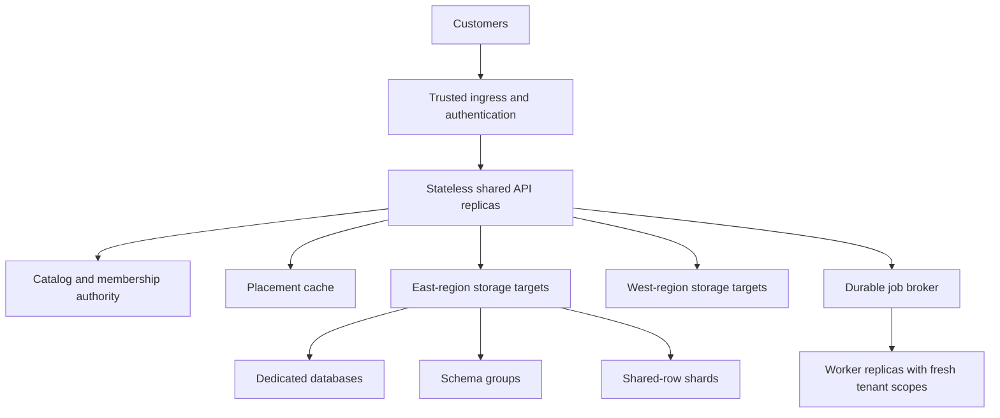

This is a target architecture, not a claim that cross-region request routing is implemented today. The placement already has `Region` and `TargetId`, and the storage factory checks consistency with configuration. Regional ingress selection, replication, failover policy, and data residency operations must still be designed.

Connection budgets multiply with deployment size. An illustrative upper-bound planning calculation is:

```text
Potential connections to one target ≈ replicas using that target × per-process pool maximum
```

Ten replicas with a pool maximum of 50 can permit roughly 500 pooled connections for that connection configuration, before separate worker/admin consumers. This is a capacity-planning bound, not a prediction of actual open connections. Database-per-tenant and schema-per-tenant designs also need limits on target/model counts retained within a process.

### 19.3 Work to complete before shared production tenancy

| Capability | Existing foundation | Next engineering work |
| --- | --- | --- |
| Shared endpoint cutover | Policy, authorizer, factories | Organization-aware login/refresh, endpoint opt-in, tenant Identity/context integration, end-to-end denial tests |
| Production schema upgrades | Admin runner, SQL locks, ledger | Tenant-aware migrations/backfill, release-aware ledger, restart/concurrency tests, rollback strategy |
| New-customer placement | Configuration allocator and lifecycle | Unique allocation, capacity/region policy, durable provisioning recovery and distributed coordination |
| Tenant relocation | Version/lifecycle metadata and worker checks | Old-writer fence, data copy/validation, cutover, rollback, cache publication, connection draining |
| Durable background work | Channel adapter and handler contract | Broker adapter, outbox/inbox or equivalent delivery design, retained idempotency records, bounded retries and dead letters |
| Noisy-neighbor protection | Process-local tenant/target gates | Aggregate limits across replicas, workload classification, hot-tenant monitoring, safe cancellation/load tests |
| Disaster recovery | Separate target concept | Backup/restore procedure per isolation mode; row-level export/restore needs more than a database restore |
| Secrets and authorization operations | External config and membership readers | Runtime/admin least privilege, rotation process, membership/authority management and audit history |
| Regional growth | Region field and target validation | Routing and residency enforcement, region failure drills, catalog availability strategy |

For relocation, incrementing `Version` and clearing a cache are not sufficient. A request can read revision 10, start writing the old database, and continue after another process publishes revision 11. A safe design must prevent or drain old writes at the persistence boundary before committing the new route.

For schema growth, the runtime factory can use a placement schema override, but the current configuration-based migration target source enumerates configured target/schema entries. Runtime routing flexibility does not automatically supply a complete migration inventory for every schema. Keep the administration model aligned with the storage allocation model.

The roadmap in [docs/saas/ROADMAP.md](saas/ROADMAP.md) provides the broader delivery sequence. Use the source and explicit integration checks above when deciding whether an individual release is ready.

## 20. A practical learning and extension sequence

Start with one company and trace a request through its Nginx route, token validation, bound context, EF filter, and SQL query. Then compare an Atlas schema query with a Delta row query. The business endpoint can look similar while the physical boundary differs.

For a new tenant-owned entity:

1. Add its ordinary domain model and EF mapping, then check that it meets the supported keyed-root model shape.
2. Verify the generated tenant property, key, foreign keys, unique indexes, and filter. Review Identity-style composite lookups if the feature uses direct keys.
3. Verify insert/update/delete ownership and any bulk/direct SQL path.
4. Add it to the reviewed tenant schema upgrade and ensure shared-row RLS covers the new table.
5. Namespace read caches and invalidation patterns identically.
6. Keep organization access checks and within-organization role/project checks distinct.
7. Test with two tenants, including colliding logical identifiers and attempts to cross-link records.

For a new infrastructure capability, identify which plane owns it first. Membership and placement belong to the control plane; a task update belongs to the data plane; schema changes belong to Admin; asynchronous work needs a fresh authorized worker scope. This separation makes later scaling and incident diagnosis much easier.

The central invariant is simple to state and broad to enforce: every operation must use one authorized organization context, and every shared resource it touches must retain that boundary. This branch demonstrates the supporting mechanisms in C#, EF mapping, SQL, caches, and Docker, while preserving explicit boundaries around the parts still awaiting production integration.
